 # **Encoding**
 ## ASCII
**Phân tích đề bài:** 

- Đề bài cho mảng số: [99, 114, 121, 112, 116, 111, 123, 65, 83, 67, 73, 73, 95, 112, 114, 49, 110, 116, 52, 98, 108, 51, 125]
- Đề yêu cầu chuyển đổi các số thành các kí tự ASCII tương ứng chứa flag.
- Gợi ý: Dùng chr() trong python để chuyển đổi

**Thực hiện:**

- Viết code python:

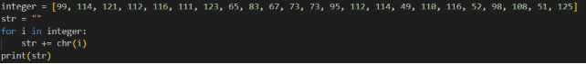

- Khai báo mảng integer, string rỗng
- Duyệt từng thành phần trong mảng và đổi sang kí tự dùng hàm chr() cộng vào string
- Hiển thị flag:

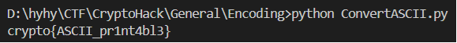
 ## Hex
**Phân tích đề bài:**

- Đề bài cho chuỗi hex: 63727970746f7b596f755f77696c6c5f62655f776f726b696e675f776974685f6865785f737472696e67735f615f6c6f747d
- Đề yêu cầu giải mã từ hex sang bytes để nhận được flag.
- Gợi ý: dùng hàm bytes.fromhex()

**Thực hiện:**

- Viết code python dùng hàm bytes.fromhex()

  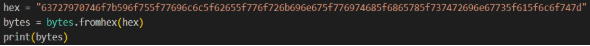

- Hiển thị flag:

  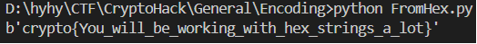
 ## Base64
**Phân tích đề bài:**

- Đề cho chuỗi hex: 72bca9b68fc16ac7beeb8f849dca1d8a783e8acf9679bf9269f7bf
- Đề bài yêu cầu giải mã chuỗi hex sang bytes rồi mã hóa thành base64

**Thực hiện:**

- Dùng 2 hàm bytes.fromhex() để chuyển hex về bytes và base64.b64encode() để mã hóa thành base64. Viết code python:

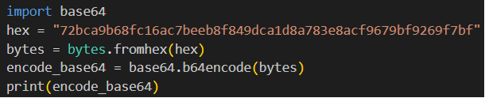

- Hiển thị flag:

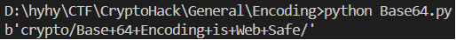
 ## Bytes and Big Integers
**Phân tích đề bài:**

- Đề cho một số nguyên lớn: 11515195063862318899931685488813747395775516287289682636499965282714637259206269
- Đề yêu cầu chuyển một dãy số nguyên dài thành thông điệp.

**Thực hiện:**

- Phân tích:
- Để chuyển đổi 1 thông điệp thành số nguyên: Thông điệp (chuỗi văn bản) → bytes → số nguyên (int) => Dùng hàm bytes\_to\_long
- Giờ ta có một số nguyên và muốn chuyển về thông điệp: Số nguyên → bytes  → chuỗi(decode) => Dùng hàm long\_to\_bytes
- Viết code python:

  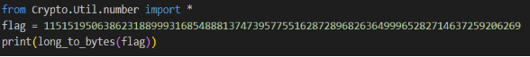

- Hiển thị flag:

  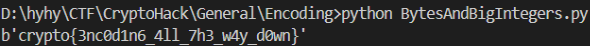
 ## Encoding Challenge
**Phân tích đề bài:**

- Đề bài yêu cầu: Viết script tự động kết nối đến server, giải mã các thông điệp qua 100 cấp độ, và gửi lại kết quả đúng để nhận **flag**.
- 2 file đính kèm: 
- 13377.py: mã nguồn phía server.
- pwntools\_example.py: mẫu code để kết nối và gửi/nhận dữ liệu.

**Thực hiện:** 

- Phân tích file 13377.py:
- Server tạo ra một chuỗi gồm 3 từ tiếng Anh ghép bằng dấu rồi mã hóa ngẫu nhiên theo 1 trong 5 kiểu:
  - "base64"
  - "hex"
  - "rot13"
  - "bigint" – là số nguyên biểu diễn chuỗi (bytes\_to\_long)
  - "utf-8" – là mảng các mã ASCII (dạng số nguyên của từng ký tự)

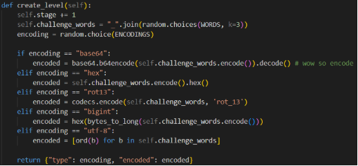

- Yêu cầu nhận flag nếu giải mã đúng 100 lần

  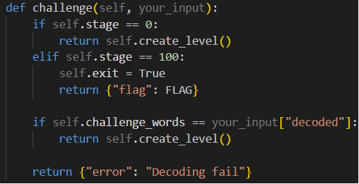

- Nhận định: Viết code nhận chuỗi mã hóa, nhận biết kiểu mã hóa, giải mã đúng, và gửi lại kết quả gốc (decoded), lặp lại 100 lần để nhận được flag.
- Viết code python:
- Kết nối server socket.cryptohack.org 13377

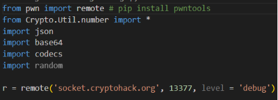

- Dùng pwntools để kết nối tới server qua TCP socket.
- level='debug' giúp in ra thông tin gửi/nhận.
- Hàm hỗ trợ gửi và nhận JSON

  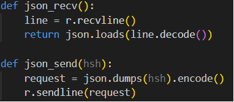

- json\_recv() đọc 1 dòng JSON từ server và chuyển thành dict.
- json\_send() gửi dict dưới dạng JSON.
- Lặp 100 cấp độ
- Nhận dữ liệu server dùng hàm json\_recv
- Dựa vào code 13377.py, ta xác định được server gửi theo định dạng "type": encoding, "encoded": encoded => từ encoding suy ra được dạng mã hóa => dùng hàm tương ứng giải thông điệp đã mã hóa encoded
- - Giải mã base 64 dựa vào hàm base64.b64decode()
- - Giải mã rot 13 dựa vào hàm codecs.decode(received["encoded"], 'rot\_13')
- - Giải mã hex dựa vào hàm bytes.fromhex()
- - Giải mã big int dựa vào hàm bytes.fromhex() // vì số nguyên chuyển thành hex có 0x đằng trước nên ta dùng hàm replace để loại bỏ nó
- - utf-8 ⇒ dùng chr() chuyển ASCII về kí tự rồi dùng ‘’.joint() để ghép thành chuỗi
- Dùng json\_send gửi lại server theo định dạng “decoded” : … dựa trên code pwntools.py

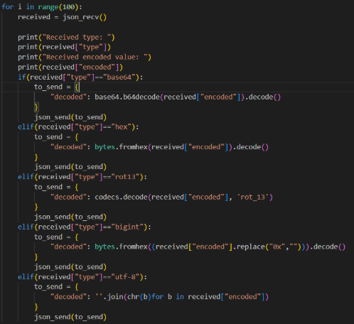

- Hiển thị flag

  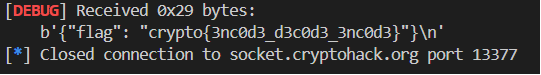

 # **XOR**
 ## XOR Starter
**Phân tích đề bài:**

- Đề bài yêu cầu xor string “label” với số nguyên 13
- Gợi ý: Dùng hàm xor trong pwntools

**Thực hiện:**

- Hàm xor không hỗ trợ xor kiểu string => Chuyển string về bytes: b’label’
- Viết code python:

  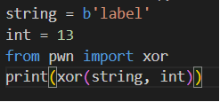

- Hiển thị flag:

  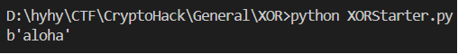
 ## XOR Properties
**Phân tích đề bài:**

- Đề bài:

  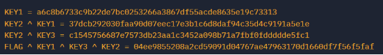

- Dựa vào các tính chất khi sử dụng XOR:

  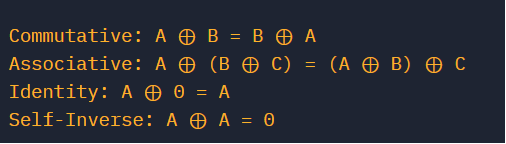

- Để tìm flag ⇒ thì phải tìm KEY2, KEY3 ⇒ dùng phép xor ngược trở lại.

**Thực hiện:**

- Chuyển dạng hex về bytes để xor : dùng hàm bytes.fromhex()
- Ta có KEY1 và kết quả KEY2^KEY1 => Tìm KEY2 = KEY1 ^ KEY2 ^ KEY1
- Tương tự để tìm được KEY3 và flag:

  

- Hiển thị flag:

  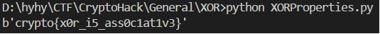
 ## Favourite byte
**Phân tích đề bài:**

- Đề bài cho chuỗi hex đã mã hóa flag bằng XOR với 1 byte bí mật: 73626960647f6b206821204f21254f7d694f7624662065622127234f726927756d => Tìm byte bí mật để giải mã được flag
- Dựa trên format của flag, ta biết được flag sẽ bắt đầu bằng chữ crypto

**Thực hiện:**

- **Cách 1:**

  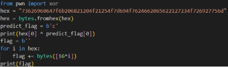

- Thử hex[0] ^ ord('c') để tìm ra khóa XOR.
- Tìm ra khóa bí mật là 16. Rồi xor khóa bí mật với từng byte. Tìm được flag.
- **Cách 2:**

  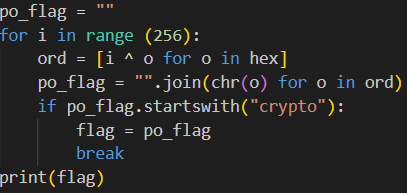

- Brute force: Thử tất cả các giá trị XOR từ 0 → 255
- Sau đó kiểm tra xem kết quả có bắt đầu bằng "crypto" không. Nếu có thì dừng lại và in ra flag
- Hiển thị flag:

  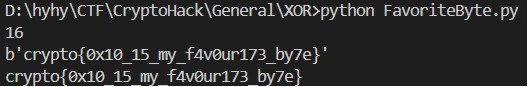
 ## You either know, XOR you don’t
**Phân tích đề bài:**

- Đề bài cho chuỗi hex là kết quả flag xor với khóa bí mật: 0e0b213f26041e480b26217f27342e175d0e070a3c5b103e2526217f27342e175d0e077e263451150104
- Tìm khóa bí mật => flag

**Thực hiện:**

- Dựa trên format flag của CryptoHack là crypto{…
- Ta xor nó với đoạn mã hóa => Tìm được khóa bí mật myXORke

  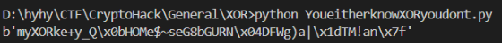

- Thử khóa bí mật myXORke, kết quả ra bị sai:

  

- Có lẽ khóa bí mật bị thiếu kí tự => dự đoán: myXORkey
- XOR khóa bí mật với chuỗi hex ban đầu được cho. Hiển thị flag:

  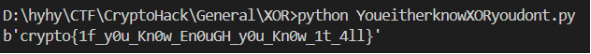
 ## Lemur XOR
**Phân tích đề bài**:

- Đề bài cho 2 file ảnh:
- flag.py
- lemur.py
- Yêu cầu: XOR giữa các byte RGB của hai hình ảnh

**Thực hiện**:

- Viết code python:

  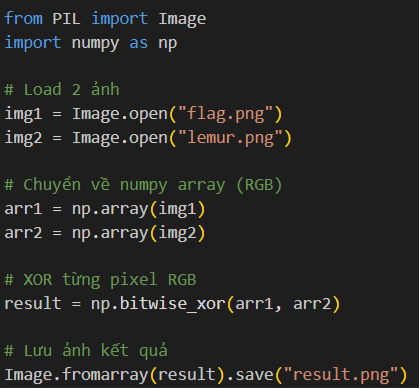

- Mở hai ảnh từ file dùng image.open
- Chuyển ảnh thành numpy array 3 chiều dạng: (shape) = (chiều cao, chiều rộng, 3) với 3 là số kênh màu RGB
- Dùng np.bitwise\_xor(arr1, arr2) để tự động XOR từng kênh màu tương ứng ở từng pixel
- Tạo ảnh kết quả, hiển thị flag:

  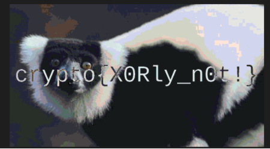
 # **Mathematics**
 ## Greatest Common Divisor
**Phân tích đề bài:** 

- Đề bài yêu cầu đơn giản tính ước chung lớn nhất của 2 số: 66528, 52920

**Thực hiện:**

- Dùng hàm math.gcd()

  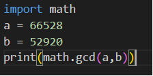

- Hiển thị kết quả:

  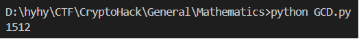
 ## Extended GCD
**Phân tích đề bài**:

- Dựa trên lý thuyết thuật toán euclid mở rộng: 

  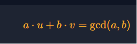

- Đề bài cho 2 số a, b và yêu cầu tìm u, v

**Thực hiện**:

- Tạo hàm extended\_euclidean(a, b) để tìm 3 giá trị:

  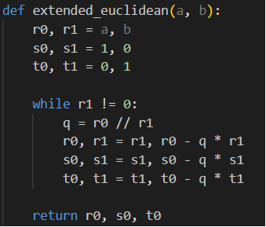

- gcd(a, b) là ước chung lớn nhất của a và b
- Hai số nguyên u, v sao cho:\
  **a \* u + b \* v = gcd(a, b)**
- In ra u, v cần tìm:

  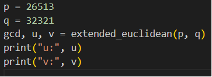

  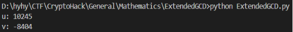
 ## Modular Arithmetic 1
**Phân tích đề bài:**

- Lấy số nhỏ hơn trong hai phép chia lấy dư

  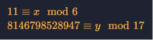

**Thực hiện:**

- Viết code python:

  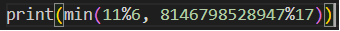

- Hiển thị kết quả:

  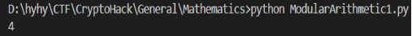
 ## Modular Arithmetic 2
**Phân tích đề bài:**

- Tính toán 27324678765465536 mod 65537

**Thực hiện:**

- Theo Fermat's little theorem, ta có 65537 là số nguyên tố, a = 273246787654 không chia hết cho 65537 => a65536≡1 mod 65537
 ## Modular Inverting
**Phân tích đề bài:**

- Đề bài yêu cầu tìm nghịch đảo nhân của số 3 trong trường hữu hạn modulo 13

**Thực hiện:**

- Theo định lý Fermat
- Với số nguyên tố p với số a không chia hết cho p, thì

  ap-1≡1 mod p⟹ ap-2≡a-1 mod p

- Vậy: 

  3-1 mod 13=311 mod 13

- Viết code python:

  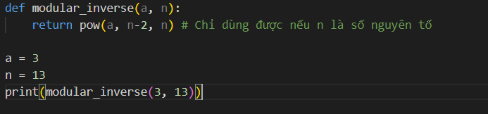

- Hiển thị kết quả:

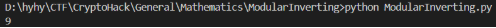
 ## Quadratic Residues
**Phân tích đề bài**:

- Cho danh sách int = [14,6,11]
- Tìm phần tử là Quadratic Residue trong danh sách đó. Tìm căn bậc hai (modulo 29) của phần tử đó, nghĩa là tìm số a sao cho:
- a2≡x (mod 29)
- Chọn nghiệm nhỏ hơn làm flag.

**Thực hiện**:

- Viết code python:

  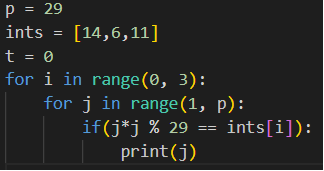

- Hiển thị kết quả:

  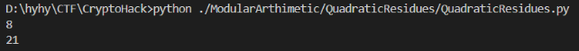

- Chọn nghiệm nhỏ hơn làm flag: 8
 ## Legendre Symbol
**Phân tích đề bài:**

- Đề cho 1 file output.txt chứa:
- Số nguyên tố lớn p
- Mảng các số nguyên 
- Dựa trên lý thuyết Legendres Symbol:

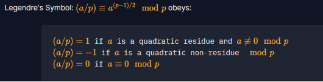

- Tức là tính toán được a(p-1)/2 mod p là xác định được số đó có phải là quadratic residue hay không.
- Đề bài cho p ≡3 mod 4, ta có công thức tính nhanh:

a=a(p+1)/4 mod 4

- Căn còn lại là p- a

**Thực hiện:**

- Viết code python:

  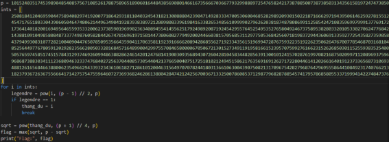

- Hiển thị kết quả:

  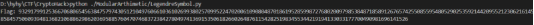
 ## Modular Square Root
**Phân tích đề bài:**

- Tìm căn bậc hai modulo một số nguyên tố lớn.
- Không thể dùng đến phương pháp phía trước => phải dùng thuật toán tổng quát hơn là **Tonelli–Shanks**

**Thực hiện:**

- Dùng thư viện hỗ trợ để dùng Tonelli-Shanks:

  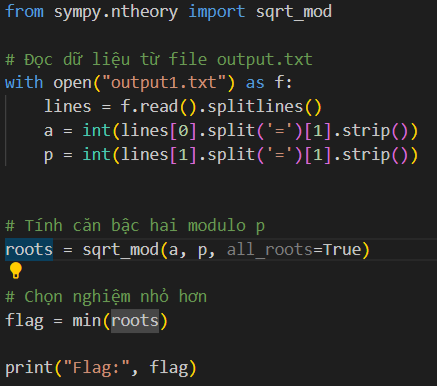

- Hiển thị flag:

  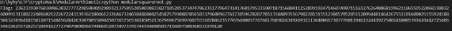
 ## Chinese Remainder Theorem
**Phân tích đề bài:**

- Đề bài yêu cầu giải hệ phương trình đồng dư bằng cách áp dụng định lý phần dư Trung Hoa (Chinese Remainder Theorem - CRT).
- Tổng quát về CRT:
- Với hệ:
  - x ≡a1 mod n1x ≡a2 mod n2x ≡ak mod nk
- Giả sử n1, n2,… nk đôi một nguyên tố thì tồn tại nghiệm duy nhất modulo N = nn2. … nk, được tính theo công thức:
  - x= i=1kai. Mi.yi mod N
- Trong đó:
  - M = nn2…nk
  - Mi = M/ni
  - yi = Mi ^ -1  mod ni (nghịch đảo modulor)

**Thực hiện:**

- Viết code python dựa trên lý thuyết đó:

  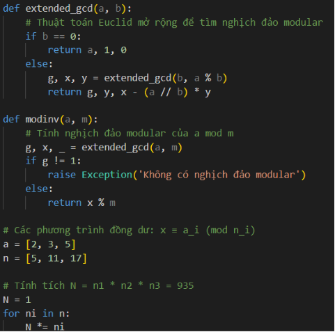

  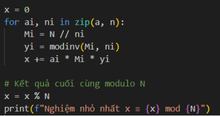

- Hiển thị kết quả, flag là 872 :

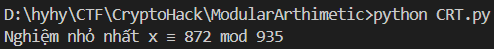
 ## ` `Modular Binomials
**Phân tích đề bài:**

- Đề bài yêu cầu tìm 2 số nguyên tố p, q 

**Thực hiện:**

- Dùng [factordb.com](http://factordb.com/) để phân tích số nguyên lớn N thành p, q

  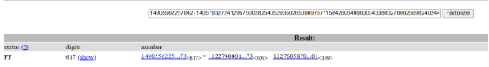
 # **Data Formats**
 ## Privacy-Enhanced Mail?
**Phân tích đề bài:**

- Đề bài cho 1 file:
- privacy\_enhanced\_mail.pem
- Yêu cầu: Trích xuất khóa riêng d dưới dạng số nguyên (decimal) từ một RSA private key định dạng PEM.

**Thực hiện:**

- Viết code python:
- Đọc file PEM chứa khóa riêng RSA
- Dùng RSA.import\_key() để phân tích nội dung
- In ra giá trị d – khóa riêng dưới dạng số nguyên (decimal)

  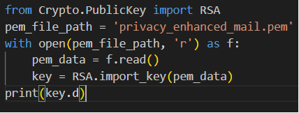

- Hiển thị kết quả:

  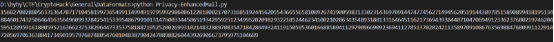
 ## CERTainly Not
**Phân tích đề bài:**

- Đề bài cho 1 file:
- 2048b-rsa-example-cer.der
- Yêu cầu: Trích xuất modulus (n) từ một chứng chỉ X.509 RSA được mã hóa ở định dạng DER, và in ra dưới dạng số nguyên (decimal).

**Thực hiện:**

- Viết code python
- Đọc file der ở chế độ nhị phân 
- x509.load\_der\_x509\_certificate(...): đọc và parse chứng chỉ DER
- Lấy khóa công khai từ chứng chỉ, trích xuất n từ khóa và in dưới dạng số nguyên

- Hiển thị kết quả

  
 ## SSH Keys
**Phân tích đề bài**:

- Đề bài cho 1 file chứa public key SSH:
- bruce\_rsa.pub
- Yêu cầu trích xuất modulus n (số nguyên) từ SSH public key (file bruce\_rsa.pub) và in ra dưới dạng số nguyên thập phân (decimal).

**Thực hiện**:

- Viết code python trích xuất:

  

- Đọc file SSH public key (bruce\_rsa.pub)
- Trích phần mã hóa base64 từ dòng SSH key
- Giải mã base64 để lấy dữ liệu nhị phân
- Lấy modulus n từ khóa RSA
- In ra modulus n dưới dạng số nguyên (decimal)
- Hiển thị kết quả:

  
 ## Transparency
**Phân tích đề bài**:

- Đề bài cho 1 file:
- transparency.pem
- Yêu cầu: Tìm subdomain của cryptohack.org đang dùng cùng cặp khóa RSA công khai (n, e) trong file transparency.pem đính kèm.

**Thực hiện**:

- Tìm các subdomain của cryptohack.org trên <https://crt.sh/>
- Tuy nhiên thì cert được cấp lại khá nhiều lần cho các domain, ta viết code để so public key với từng cert của từng domain
- Thử qua các domain: aes, tls1, tls2,… đều không đúng. Tiếp theo thử đến thetransparencyflagishere

  

  

  

- Tìm thấy cert có public key trùng khớp. Đây là subdomain cần tìm

  
 # **RSA**
 ## Modular Exponentiation
**Phân tích đề bài**:

- Yêu cầu tính 10117mod 22663

**Thực hiện**:

- Dùng hàm pow tính lũy thừa của 101 với số mũ 17 mod 22663

  

- Hiển thị kết quả

  
 ## Public Keys
**Phân tích đề bài**:

- Đề bài cho p, q, e và số 12 yêu cầu mã hóa số 12 sử dụng RSA

**Thực hiện**:

- Ta tính N = p\*q
- Ciphertext = 12 mũ 65537 mod N

  

- Hiển thị kết quả:

  
 ## Euler's Totient
**Phân tích đề bài**:

- Đề bài cho 2 số p, q, yêu cầu tính phi hàm euler

**Thực hiện**

- Euler totient of N = (p-1)\*(q-1)

  

- Hiển thị kết quả

  
 ## Private Keys
**Phân tích đề bài**:

- Đề bài cho 2 số p, q và public key e. Yêu cầu tính khóa riêng tư d dựa trên công thức

  

**Thực hiện**:

- Tính euler totient của N = (p-1)(q-1)
- d = inverse(65537, N) (hàm hỗ trợ tính nghịch đảo modulo)

  

- Hiển thị kết quả:

  
 ## RSA Decryption
**Phân tích đề bài**:

- Yêu cầu giải mã thông điệp từ nội dung đã mã hóa RSA

**Thực hiện**:

- Giải mã RSA: m = c mũ d mod N

  

- Hiển thị kết quả:

  

 ## Factoring
**Phân tích đề bài**:

- Yêu cầu phân tích N thành 2 số nguyên tố 
- Lấy số nhỏ hơn trong 2 số

**Thực hiện**

- Dùng [factordb.com](http://factordb.com/) ⇒ phân tích N thành 2 số nguyên tố ⇒ lấy số nhỏ hơn
 ## Inferius Prime
**Phân tích đề bài**:

- Đề cho số n 1600 bits => Ta cần phân tích được n thành 2 số nguyên tố để giải ra plaintext

**Thực hiện**:

- Dùng [factordb.com](http://factordb.com/) ⇒ phân tích n thành 2 số nguyên tố p, q ⇒ phi = (p-1)(q-1)
- Tìm khóa bí mật d = inverse(e, phi)
- Tìm được plaintext = long\_to\_bytes(pow(ct,d,n))

  

- Hiển thị kết quả:

  
 ## Square Eyes
**Phân tích đề bài**:

- Dựa trên mô tả của đề bài, ta thấy được người ta đang cố tạo 2 số nguyên tố 2048 bit. Tuy nhiên việc này rất mất thời gian, vì vậy thay vì tạo 2 số nguyên tố 2048 bit, họ tạo 1 số nguyên tố mà dùng 2 lần => Gây ra lỗ hổng lớn.

**Thực hiện**:

- Dùng [factorb.com](http://factorb.com/). Ta tìm được số nguyên tố bình phương thành n

  ⇒ phi n = n - số nguyên tố đó

- Tìm d = inverse(e,phi n)
- Tìm được plaintext = long\_to\_bytes(pow(ct,d,n))

  

- Hiển thị kết quả:

  
 ## Monoprime
**Phân tích đề bài**:

- Đề bài dùng n là số nguyên tố thay vì phân tách n thành 2 số nguyên tố  p, q.

**Thực hiện**:

- Ta có công thức chung của phi hàm euler = n \* (1-1/p)\*…. với p là các thừa số nguyên tố của n.
- Vì n chính là 1 số nguyên tố ⇒ phi hàm euler (n) = n \* ( 1 - 1/n) = n – 1
- Ta tính d bằng cách tính nghịch đảo modulo
- Sau khi có d thì chỉ cần giải mã m = ct^d % n ⇒ chuyển m từ số về bytes

  

- Hiển thị kết quả:

  
 ## Manyprime
**Phân tích đề bài**: 

- Thay vì phân tích n thành 2 số nguyên tố thì người ta phân tích n thành nhiều số nguyên tố

**Thực hiện**:

- Ta có công thức chung của phi hàm euler = n \* (1-1/p)\*…. = ( p - 1)\*… với p, q… là các thừa số nguyên tố của n
- Ở đây ta dùng [factorb.com](http://factorb.com/) ⇒ phân tích n ra thừa số nguyên tố ⇒ tính phi hàm euler (n)
- Nghịch đảo modul rồi tính m = ct^d % n

  

- Hiển thị kết quả:

  
 ## Salty
**Phân tích đề bài**:

- Đề bài này ta thấy e = 1 và n rất lớn, ct (ciphetext) nhỏ ⇒ ct = m ⇒ chỉ cần chuyển ct về bytes là được

**Thực hiện**:

- Viết code chuyển ciphertext về bytes

  

- Hiển thị kết quả:

  
 ## ` `Modulus Inutilis
**Phân tích đề bài**:

- Đề bài cho e rất nhỏ = 3, và n rất lớn nên suy ra ct (ciphertext) = m^3  chỉ cần tính căn bậc 3 của ct là ra được m

**Thực hiện**:

- Viết code tính căn bậc 3 của ciphertext rồi chuyển về dạng bytes:

  

- Hiển thị kết quả:

  
 ## Endless Emails
**Phân tích đề bài**:

- Đề bài đưa ra rất nhiều ciphertext những không biết những ciphertext nào cùng được mã hóa từ 1 thông điệp với số mũ e công khai rất nhỏ = 3 và n khác nhau => Dùng phương pháp Hastadʼs Broadcast Attack

**Thực hiện**:

- Duyệt lần lượt cứ 3 modul và 3 cipher dùng hàm crt (thặng dư trung hoa).
- Lấy căn bậc 3 của những số đó rồi chuyển về bytes để tìm được flag.

  

- Hiển thị kết quả:

  
 ## Infinite Descent
**Phân tích đề bài**:

- Đề bài cho n, e và ciphertext

**Thực hiện**:

- Dùng [fac](http://facdb.com/)tordb.com ⇒ phân tính n ra 2 số nguyên tố p, q rồi tính phi, nghịch đảo modul và ra m bình thường.

  

- Hiển thị kết quả

  
 ## Everything is Still Big
**Phân tích đề bài**:

- Đề bài cho n, e và ciphertext ở dạng hex

**Thực hiện**

- Chuyển n từ dạng hex về dạng số nguyên
- Dùng [fac](http://facdb.com/)tordb.com ⇒ phân tính n ra số nguyên tố rồi tính phi, nghịch đảo modul và ra m bình thường.

  

- Hiển thị kết quả:

  
 ## Crossed Wires
**Phân tích đề bài**:

- Dựa trên đoạn mô tả và đoạn code source.py được cung cấp thì tức là thay vì dùng khóa công khai của người gửi để mã hóa, thì 5 người họ mỗi người lại mã hóa bằng khóa công khai của chính họ => tạo ra ciphertext được mã hóa bởi nhiều lớp khác nhau

**Thực hiện**:

- Cùng modulus N, nhưng mỗi bạn bè dùng một eᵢ khác nhau để mã hóa.
- Vì mỗi người mã hóa lên bản mã trước đó ⇒ Tổng hợp lại ta có:

  c=mee2…e5 mod n

- Dùng [factordb.com](http://factordb.com/) ⇒ phân tích n ra hai số p, q
- Ta sẽ nghịch đảo modul của phi với những friend key
- Giải mã cipher từ từ ⇒ ra được flag

  

- Hiển thị kết quả:

  
 # **Symmetric Cryptography**
 ## Keyed Permutations
**Phân tích đề bài**:

- Đề mô tả một đặc tính quan trọng của AES (và các block cipher nói chung) — đó là việc mã hóa là một ánh xạ có thể đảo ngược, tức:
  - Mỗi đầu vào (input block) ánh xạ duy nhất đến một đầu ra (output block), và ngược lại.
- Đề hỏi What is the mathematical term for a one-to-one correspondence? 

**Thực hiện**:

- The mathematical term for a one-to-one correspondence: bijection
- "Bijection”: một hàm f: A→B được gọi là một bijection nếu nó đồng thời là một hàm cắm (injective) (mỗi phần tử của A được ánh xạ tới một phần tử duy nhất của B) và một hàm mở (surjective) (mỗi phần tử của B được ánh xạ từ ít nhất một phần tử của A)
 ## Resisting Bruteforce
**Phân tích đề bài**:

- AES là hàm hoán vị có khóa, có thể mã hóa và giải mã. AES-128 có 2¹²⁸ khóa, brute-force rất chậm. Có một tấn công nhanh hơn brute-force một chút, giảm độ bảo mật xuống 126.1 bit. Tấn công này chỉ mang tính lý thuyết, không nguy hiểm thực tế. Đề hỏi tên của tấn công đó là gì?

**Thực hiện**:

- The name for the best single-key attack against AES: biclique
 ## Structure of AES
**Phân tích đề bài**:

- Viết hàm matrix2bytes() để chuyển đổi một ma trận (4x4) các byte (gọi là *state matrix* trong AES) trở lại dạng chuỗi 16 byte như ban đầu.

**Thực hiện**:

- Dùng hàm long\_to\_bytes chuyển từng phần tử của matrix sang bytes rồi cộng vào flag

  

- Hiển thị kết quả:

  
 ## Round Keys
**Phân tích đề bài**:

- KeyExpansion biến khóa chính (16 byte) thành 11 khóa vòng (round keys) — mỗi khóa là một ma trận 4x4 byte.
- AddRoundKey: Bước XOR đơn giản giữa state và round\_key
- Đề bài yêu cầu: Viết hàm add\_round\_key(state, round\_key). Hàm này sẽ XOR từng byte trong ma trận trạng thái (state) với byte tương ứng trong ma trận khóa vòng (round\_key). Sau đó chuyển kết quả thành chuỗi bytes → đó chính là flag

**Thực hiện**:

- Hàm add\_round\_key sẽ xor từng phần tử của state với phần tử của roundkey ⇒ trả về flag

  

- Hiển thị kết quả:

  
 ## Confusion through Substitution
- Viết hàm sub\_bytes: 
  - Lấy 4 bit trọng số cao nhất ⇒ hàng
  - Lấy 4 bit trọng số thấp nhất ⇒ cột
  - Dò bảng ⇒ số mới thay thế vào các phần tử trong state
- Chuyển đổi state mới hình thành về long\_to\_bytes ⇒ flag

  

- Hiển thị kết quả:

  
 ## Diffusion through Permutation
- Viết hàm inv\_shift\_rows: 
- Dòng thứ nhất giữ nguyên
- Dòng thứ 2 dịch vòng phải 1 byte
- Dòng thứ 3 dịch vòng phải 2 byte
- Dòng thứ 4 dịch vòng phải 3 byte
- Sau đó để state đi qua 2 hàm inv\_mix\_columns state và inv\_shift\_rows ⇒ chuyển long\_to\_bytes ⇒ flag

  

- Hiển thị kết quả

  
 ## Bringing It All Together
- Giải mã AES dựa trên:

  

- Kết hợp các hàm viết ở các bài trước: inv\_mix\_columns, inv\_shift\_rows, inv\_sub\_bytes, …
- Hiển thị kết quả giải mã:

  
 ## Modes of Operation Starter
- AES mã hóa trên các block cố định, khi thông điệp dài hơn các block đó thì cần dùng đến các mode. Bài này chỉ đơn giản là tương tác với API sử dụng mode ECB
- Ta sẽ lấy ciphertext bằng cách ấn vào submit chỗ encrypted\_flag()

  

- Sau đó ta decrypt ciphertext ở khối DECRYPT(CIPHERTEXT) ⇒ plaintext

  

  

- Plaintext ở dạng hex nên ta sẽ chuyển đổi hex về text ở khối HEX ENCODER/DECODER ⇒ flag

  
 ## Passwords as Keys
**Phân tích đề bài**:

- Trong hệ mật mã đối xứng (ví dụ AES), khóa phải là chuỗi byte ngẫu nhiên, được tạo từ CSPRNG (Cryptographically Secure Pseudorandom Number Generator).
- Nếu khóa được tạo từ mật khẩu, hoặc từ dữ liệu có thể đoán được (predictable), thì độ bảo mật bị giảm nghiêm trọng.
- Trong bài này, khóa không phải ngẫu nhiên, mà được tạo từ một password đơn giản và được băm (hash) lại → có thể bị tấn công (crackable).

**Thực hiện**:

- Lấy ciphertext bằng cách ấn submit chỗ encrypted\_flag()

  

- Ta thấy được keyword được chọn random trong [https://gist.githubusercontent.com/wchargin/8927565/raw/d9783627c731268fb2935a731a618aa8e95cf465/words và dùng hash md5](https://gist.githubusercontent.com/wchargin/8927565/raw/d9783627c731268fb2935a731a618aa8e95cf465/words%20và%20dùng%20hash%20md5)

  

- Để giải mã, ta tải file xuống, viết code duyệt từng từ trong keyword, đưa vào hàm hash md5
- Mã Hóa AES với KEY đưa vào decrypted
- Nếu xuất hiện chữ crypto trong decrypted ⇒ in ra flag

  

- Hiển thị kết quả:

  
 ## ECB ORACLE
**Phân tích đề bài**:

- Đề bài cho một hệ thống/API cho phép bạn gửi input tùy ý, không có hàm giải mã, nhưng bạn có thể gửi nhiều input khác nhau và xem ciphertext tương ứng.
- ECB: cắt bản rõ trực tiếp thành các khối và sau đó mã hóa chúng bằng cùng một khóa, bản mã thu được là "độc lập với nhau", nghĩa là nếu hai bản rõ giống nhau thì bản mã cuối cùng. sẽ giống nhau. => khai thác điểm yếu

**Thực hiện**:

- Khi ta nhập 15 “a”: “aaaaaaaaaaaaaaaX….. ”
- Khi ta nhập 16 “a”: “aaaaaaaaaaaaaaaa …..”
- Có thể thấy nếu thay X = a thì ciphertext của 15 “a” = ciphertext của 16 “a” ⇒ Ký tự đầu tiên của plaintext là a
- Khi ta nhập 14 “a” + kí tự đầu tiên của plaintext đặt là T : “aaaaaaaaaaaaaaTX ….” ⇒ tạo vòng lặp ⇒ flag

  
 ## ECB CBC WTF
**Phân tích đề bài**:

- Đề bài cho phép mã hóa ở chế độ CBC, nhưng giải mã lại là ECB
- ECB: mã hóa block độc lập, CBC: Mỗi block phụ thuộc block trước (dùng XOR)

**Thực hiện**:

- Dùng CBC mã hóa, ECB giải mã, ECB giải mã từng block riêng biệt giúp ta biết được khối trước khi truyền vào bao gồm plaintext XOR với khối mã hóa trước, cứ giải mã lần lượt sẽ tìm được plaintext.
- Lấy Encrypted\_flag ở khối Encrypted\_Flag()

  

- Đọc code thì ta thấy được IV chứa 16 bytes tức 32 bit, còn lại là ciphertext
- Ta chia đều ciphertext thành 2 phần, mỗi phần chứa 16 bytes
- Ta giải mã cả 2 phần ciphertext trong khối decrypt(ciphertext)
- Rồi ta lấy giải mã ciphertext 1 xor IV ⇒ plaintext1
- Lấy ciphertext1 xor với giải mã ciphertext2 ⇒ plaintext2

  

- Ghép 2 plaintext lại ta được flag
 ## Flipping Cookie
- Ta lấy ciphertext ở phần get\_cookie()
- Đọc code ta thấy được phần IV chứa 16 bytes, còn lại là ciphertext
- Hàm check\_admin() ⇒ khi nào admin = True ⇒ in ra flag

  

- Ciphertext ^ IV = False
- Để chuyển False thành True ⇒ IV mới ^ Ciphertext = True ⇒ IV mới = IV^False^True

  

  

- Đưa ciphertext và IV mới vào \*\*CHECK\_ADMIN(COOKIE,IV) ⇒ flag\*\*

  
 ## Symmetry
- Lấy encrypted\_flag() ở khối ENCRYPTED\_FLAG()

  

- IV vẫn chứa 16 bytes, còn lại là ciphertext

  

- Giờ ta chỉ cần bỏ IV và ciphertext vào ENCRYPT(PLAINTEXT,IV) ⇒ flag ở dạng hex ⇒ đưa vào HEX ENCODER/DECODER ⇒ tìm ra flag

  
 # **Hash Function**
 ## Jack's Birthday Hash
**Phân tích đề bài**:

- Hàm băm JACK11 nhận vào một chuỗi (secret) và xuất ra một chuỗi bit dài 11 bit.
- Jack đã dùng JACK("secret") và nhận được giá trị: 01011001101
- Yêu cầu: Cần thử bao nhiêu chuỗi khác nhau để có 50% cơ hội xảy ra collision (tức là có chuỗi nào đó cũng ra cùng hash với "secret")?

**Thực hiện**:

- Vì có mảng bit có độ dài là 11, nên ta sẽ có n = 211 giá trị
- Gọi P(A) là xác suất trong 211 giá trị có ít nhất một giá trị xảy ra collision với secret của Jack
- Vậy P’(A) là xác suất trong 211 giá trị không có giá trị nào xảy ra collision với secret của Jack = (n-1n)k.
- Vậy P(A) là 1 - P’(A) = 1 -  (n-1n)k.
- Ta sẽ tạo vòng lặp chạy từ i tới n. Khi nào xác suất đạt tới 50% thì ta được số giá trị cần có là k = i rồi ta dừng vòng lặp

  

- Hiển thị kết quả:

  
 ## Jack's Birthday Confusion
**Phân tích đề bài**:

- Yêu cầu: "Có bao nhiêu unique secrets cần băm, để có 75% xác suất xảy ra ít nhất một cặp collision giữa hai chuỗi bất kỳ?"

**Thực hiện**

- Vì có mảng bit có độ dài là 11, nên ta sẽ có n = 211 giá trị
- Gọi P(A) là xác suất trong 211 giá trị có ít nhất hai phần tử có giá trị băm giống nhau
- Vậy P’(A) là xác suất trong 211 giá trị không có giá trị băm nào xảy ra collision n!/(n-k)!(n^k)
- ⇒ P(A) = 1 - P’(A)

  

- Hiển thị kết quả:

  

--- **END** ---

