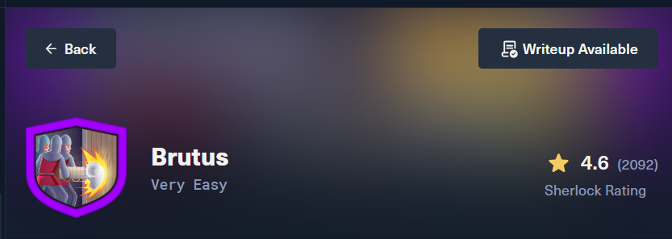
# Challenge Profile

- **Platform:** HackTheBox
- **Track:** Sherlocks (Defensive Security / Blue Team)
- **Category:** DFIR (Digital Forensics and Incident Response)
- **Difficulty Level:** Very Easy
- **Sherlock Scenario:**: In this very easy Sherlock, you will familiarize yourself with Unix `auth.log` and `wtmp` logs. We'll explore a scenario where a Confluence server was brute-forced via its SSH service. After gaining access to the server, the attacker performed additional activities, which we can track using `auth.log`. Although `auth.log` is primarily used for brute-force analysis, we will delve into the full potential of this artifact in our investigation, including aspects of privilege escalation, persistence, and even some visibility into command execution.

# Solving

### Task 1

- **Question:** Analyze the `auth.log`. What is the IP address used by the attacker to carry out a brute force attack?

- **Analysis:**
  - The auth.log file records all successful and failed logins, as well as commands executed with sudo privileges.
  - When an attacker performs a brute-force attack, they generate a massive amount of failed login logs.
  - Filter the lines containing "Failed password" to see which IP appears the most frequently: `cat auth.log | grep "Failed password"`

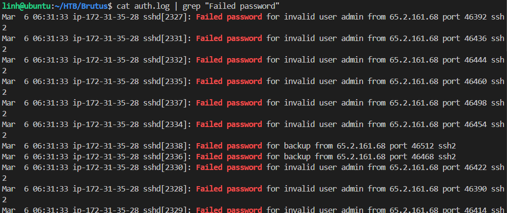
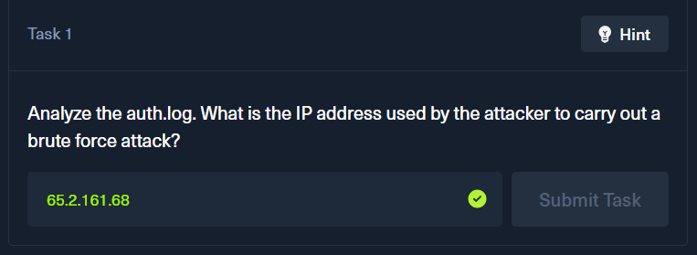

### Task 2

- **Question:** The bruteforce attempts were successful and attacker gained access to an account on the server. What is the username of the account?

- **Analysis:**
  - When the attacker guess the correct password and login successfully, the log will record an "Accepted password".
  - Filter the lines containing "Accepted password": `cat auth.log | grep "Accepted password"`.
  
  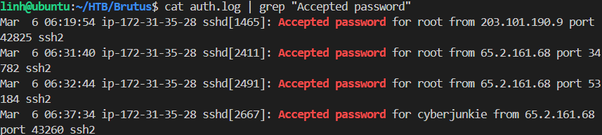.

  - There are two accounts from 65.2.161.68 (Attacker's IP) with "Accepted password". I searched the account "cyberjunkie" in auth.log and see that information.

  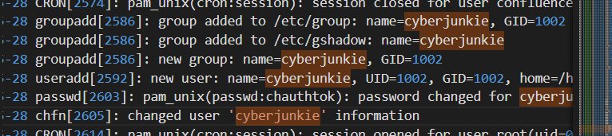

  - After logging into `root` at 06:31:40, attacker began creating a new account `cyberjunkie`. 

  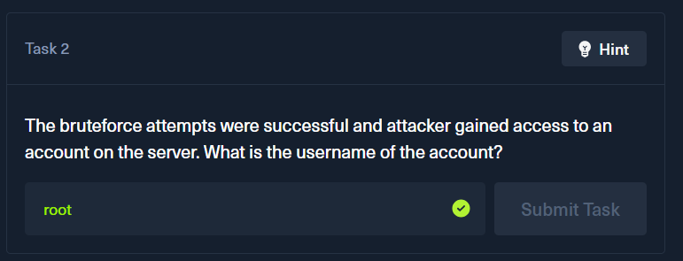

### Task 3

- **Question:** Identify the UTC timestamp when the attacker logged in manually to the server and established a terminal session to carry out their objectives. The login time will be different than the authentication time, and can be found in the wtmp artifact.

- **Analysis:**

  - Run `utmp.py` to read the Linux utmp file and export current user login session information into a TSV: `python3 utmp.py wtmp | grep "65.2.161.68`

  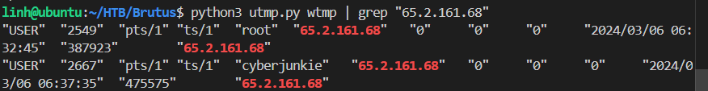
  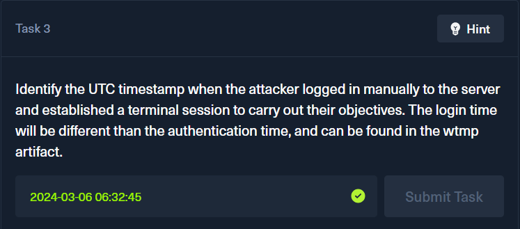

### Task 4

- **Question:** SSH login sessions are tracked and assigned a session number upon login. What is the session number assigned to the attacker's session for the user account from Question 2?

- **Analysis:**

  - Run command: `grep "root" auth.log | grep "New session"`
  
  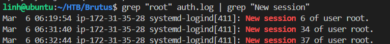

  - Session is opened on 2024-03-06 06:32:45. So, the result is
  
  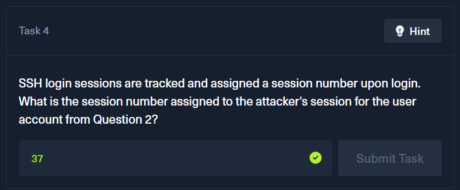

### Task 5

- **Question:** The attacker added a new user as part of their persistence strategy on the server and gave this new user account higher privileges. What is the name of this account?

- **Analysis:**

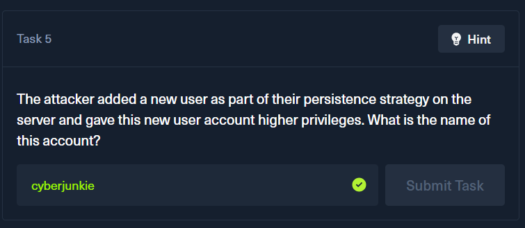

### Task 6

- **Question:** What is the MITRE ATT&CK sub-technique ID used for persistence by creating a new account?

- **Analysis:**
  - Search google.com :))

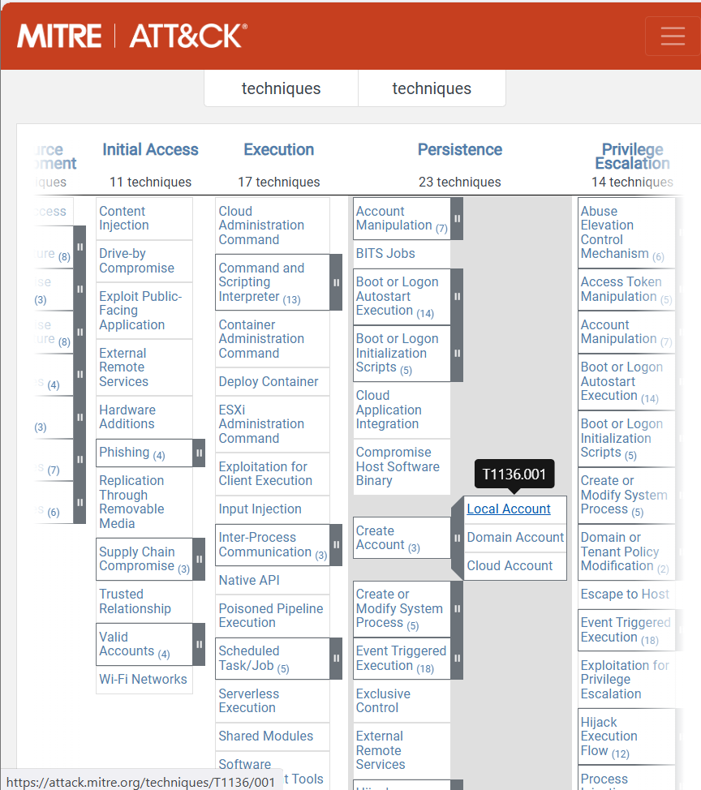

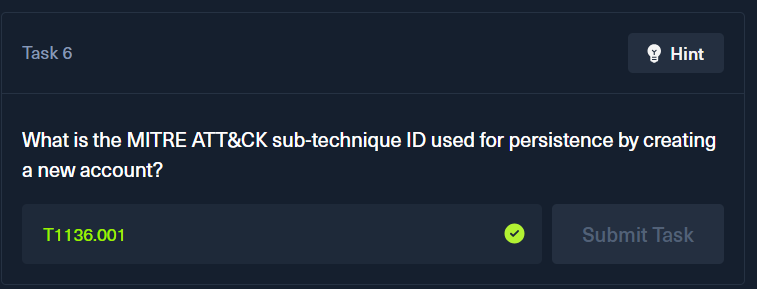

### Task 7

- **Question:** What time did the attacker's first SSH session end according to `auth.log`?

- **Analysis:**
  - Run command: `grep "root" auth.log | grep "session"`
    - CRON is a system scheduler that runs automated tasks.
    - sshd is the Secure Shell service used by the attacker to login.

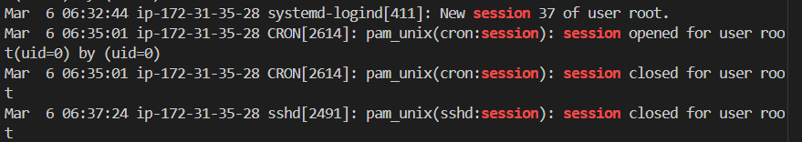

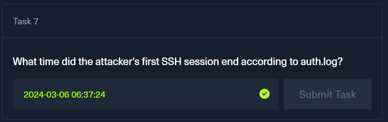

### Task 8

- **Question:** The attacker logged into their backdoor account and utilized their higher privileges to download a script. What is the full command executed using sudo?

- **Analysis:**
  - Run command: `grep "sudo" auth.log | grep "cyberjunkie"`

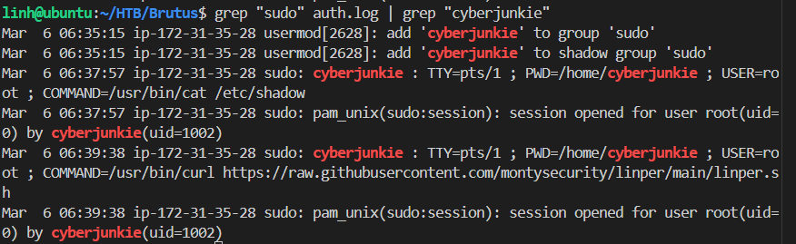

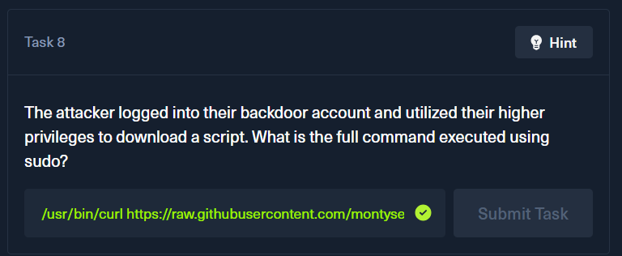