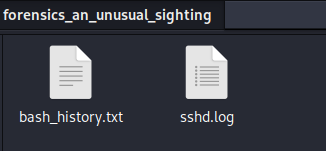
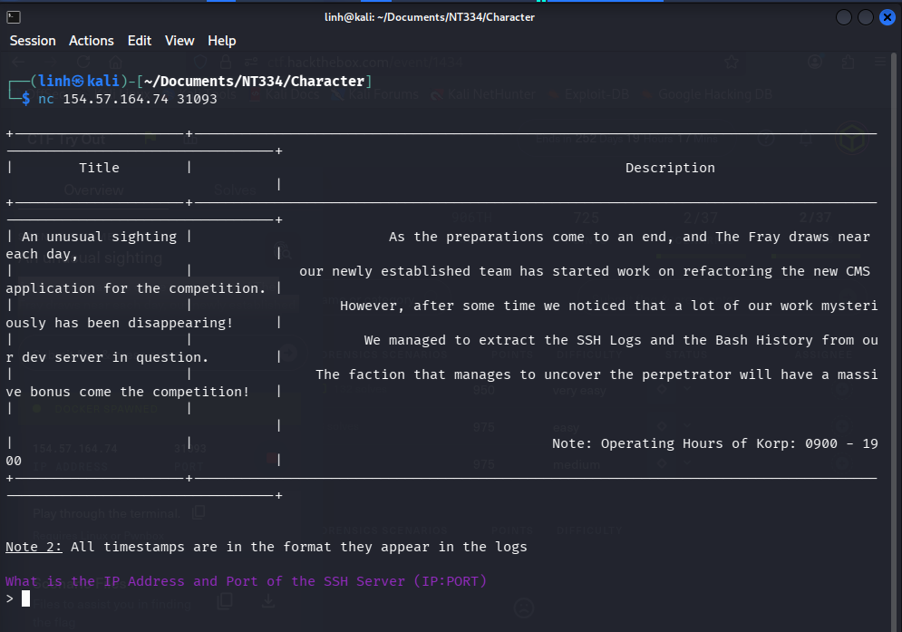
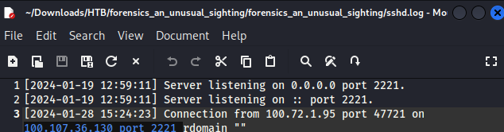
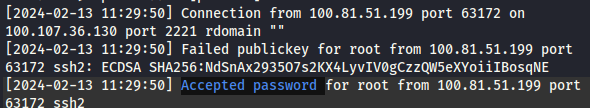
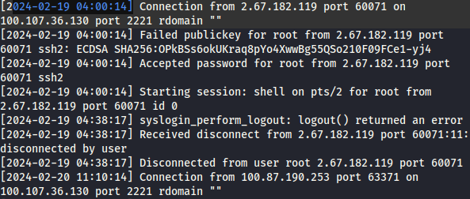
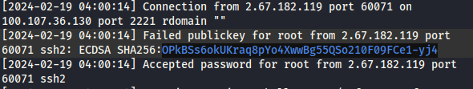
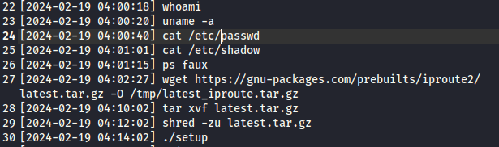
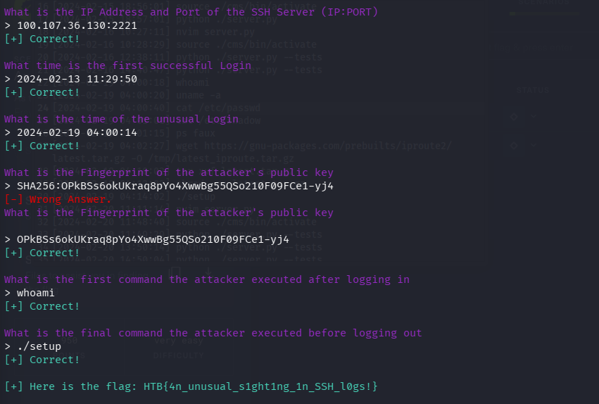
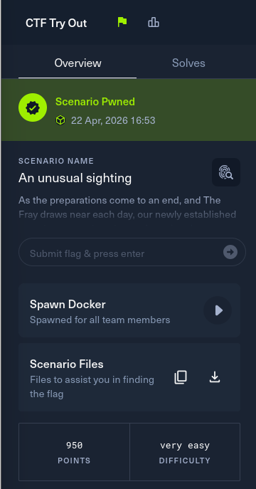

# Overview

### Scenario

**Name**: An unusual sighting

**Description**: As the preparations come to an end, and The Fray draws near each day, our newly established team has started work on refactoring the new CMS application for the competition. However, after some time we noticed that a lot of our work mysteriously has been disappearing! We managed to extract the SSH Logs and the Bash History from our dev server in question. The faction that manages to uncover the perpetrator will have a massive bonus come competition!

# Solving

- Run `nc 154.57.164.74 31093` to connect server and downloand folder for this scenario.
- The folder contains file logs for ssh service and history.
- After establishing the connection with server, some question related to file logs and require the answer to get the flag.

- Open file sshd.log for the first question.

- From: sender require connect and on: server which is connected.

- The second question, find the first line having accepted password (successful connection)

- The third question, see that user often connect server via ssh between 9h and 19h. But there are one connecion at 4h a.m. That is the unsual connection.

- Public key appear on screen after `connection` line.
.

- The attacker exploit at `04:00:14` and disconnect at `04:38:17`. Based on time, find the answer for the fourth question and fifth question.

- After answer the questions correctly, get the flag.

