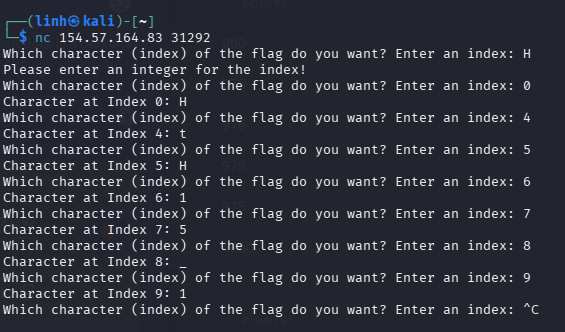
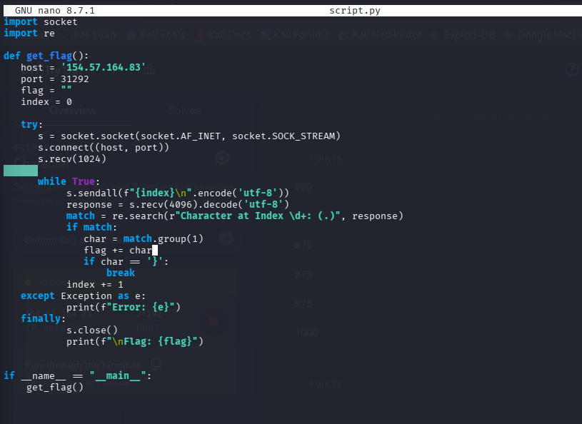
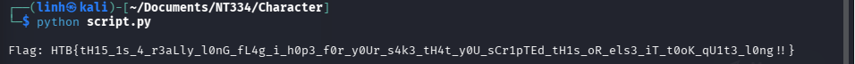
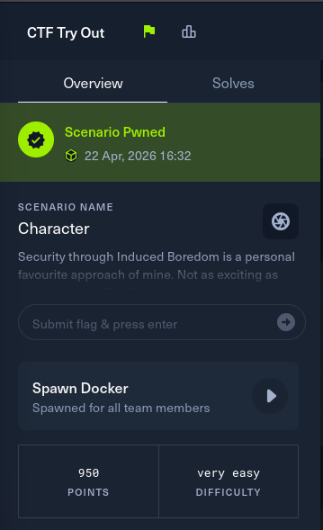

# Overview

### Scenario

**Name**: Character

**Description**: Security through Induced Boredom is a personal favourite approach of mine. Not as exciting as something like The Fray, but I love making it as tedious as possible to see my secrets, so you can only get one character at a time!

# Solving

- Run `nc 154.57.164.83 3192` to connect docker.
- After establishing the connection, the screen displays a prompt asking for a flag index and returns the character at that position.

- Given that the Hack The Box flag format is `HTB{...}`, the flag will end with a `}` character.
- Write a script to automatically connect to the server and input increments of the index until the closing brace is found, then stop and print the flag.

