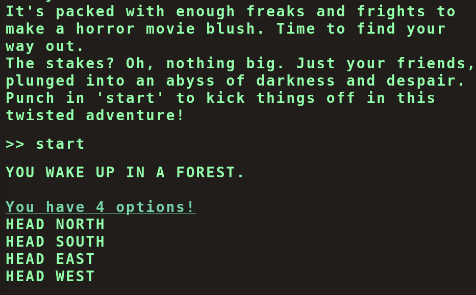
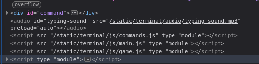
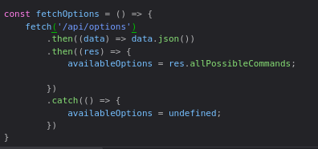
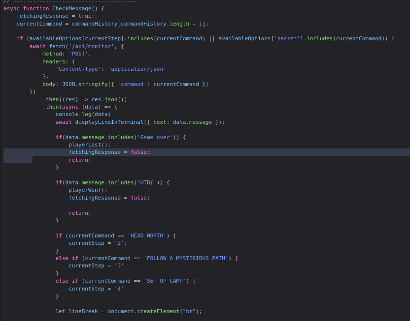
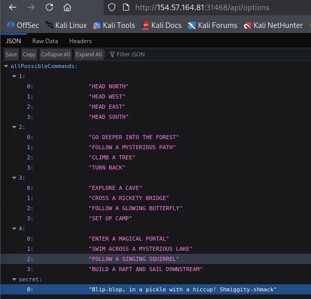
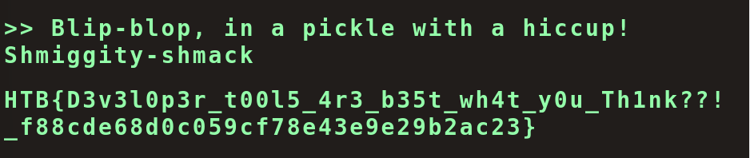
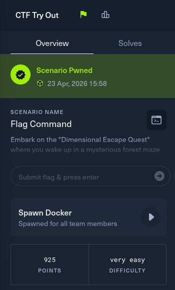

# Overview

### Scenario

**Name**: Flag Command

**Description**: Embark on the "Dimensional Escape Quest" where you wake up in a mysterious forest maze that's not quite of this world. Navigate singing squirrels, mischievous nymphs, and grumpy wizards in a whimsical labyrinth that may lead to otherworldly surprises. Will you conquer the enchanted maze or find yourself lost in a different dimension of magical challenges? The journey unfolds in this mystical escape!

# Solving

- Access to the website: `http://154.57.164.81:31468/` see the emulated terminal interface -> Enter the command with normal movements (HEAD NORTH,...)

- View source code and see relative scripts: main.js, game.js and command.js.

- Debugger -> view source code of these files. In file `main.js`, the function fetchOptions call `/api/options` -> retrieve the list of available commands from the server and store them in to `availableOptions`.

- Function CheckMessage(): if having secret commands in availabelOptions, maybe having the flag

- Access to the link: `/api/options` and see the secret.

- Enter the secret and get the flag.

