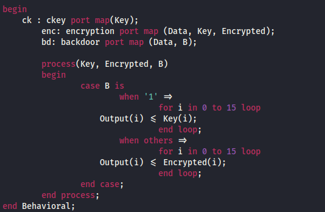
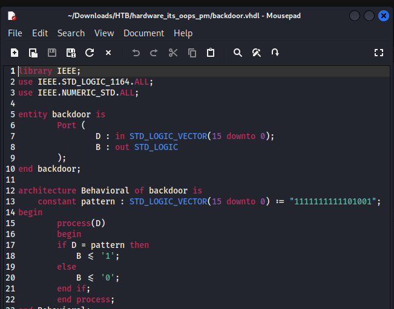
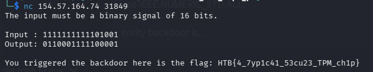

# Overview

### Scenario

**Name**: It's Oops PM

**Description**: With the location of the underground bunker secured, the crew embarks on the next phase of their plan: assessing the feasibility of creating an underground tunnel to bypass the super mutant camp. They secure samples of water, soil, and air near the area. Scouring the wasteland for salvageable equipment, they stumble upon a dilapidated research facility where they find a cache of environmental sensors. Examining these sensors, the crew discovers they communicate with a satellite and contain a crypto-processor that encrypts their transmissions. After hand-drawing the diagrams and emulating the silicon chip's logic with VHDL, they uncover what appears to be a backdoor in the embedded logic that only triggers when a specific input is given to the system. Determined to exploit this, they turn to their tech specialist. Can you connect to the satellite and activate it?

# Solving

- Run `nc 154.57.164.74 31849` to connect server, screen displays a requirement: Enter the input.

- Download folder and extract zip, open the image -> Chip TPM execution thread:
 
  - Path 1: Input -> Crypto (encrypt with Key) -> Mux (Secure Output)
  - Path 2: Input -> Logic -> Mux 

- Firstly, file `tpm.vhl` contains logic code for chip:
  - `case B = 0`: create encrypted output.
  - `case B = 1`: display private key

- Attacker exploit this -> create file `backdoor.vhl` (Logic).
When input = 1111111111101001 -> B = 1 -> active Mux to get the key.

