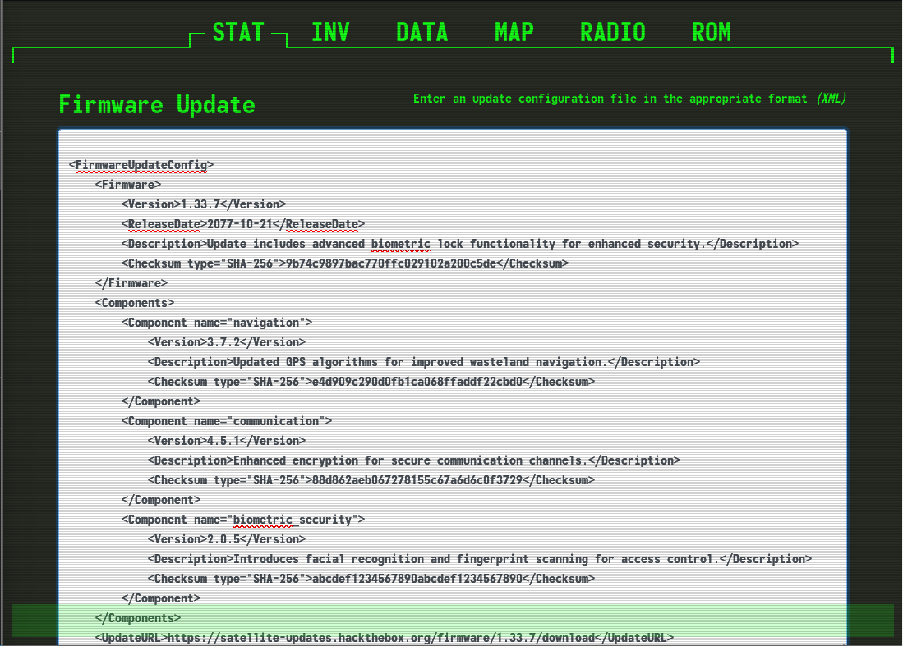
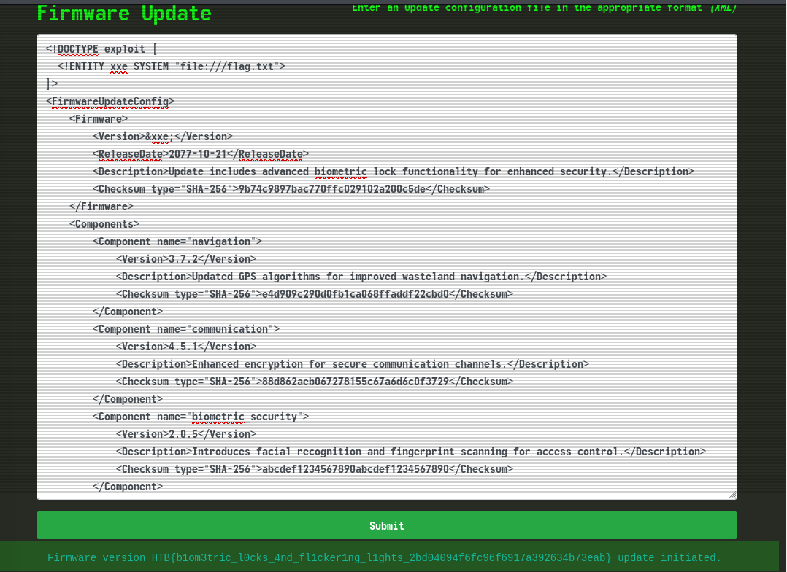
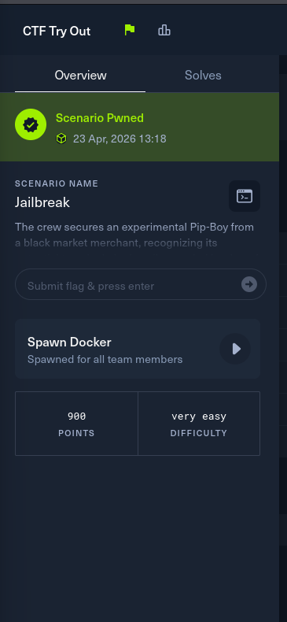

# Overview

### Scenario

**Name**: Jailbreak

**Description**: The crew secures an experimental Pip-Boy from a black market merchant, recognizing its potential to unlock the heavily guarded bunker of Vault 79. Back at their hideout, the hackers and engineers collaborate to jailbreak the device, working meticulously to bypass its sophisticated biometric locks. Using custom firmware and a series of precise modifications, can you bring the device to full operational status in order to pair it with the vault door's access port. The flag is located in /flag.txt

# Solving

- Spawn docker and access website: `http://154.57.164.71:30439`

- Description: `The flag is located in /flag.txt`, and I found an XML-based update configuration file at http://154.57.164.71:30439 which allows user edit code.

- The XML specification supports the use of External Entities to fetch local file contents via the file:// URI scheme -> XXE External Entity(XXE) Injection Vulnerability: `https://portswigger.net/web-security/xxe`

- Leverage the XXE vulnerability to define an external entity that forces the server to read the local flag file.

- Observe web reflects the <Version> value on the screen -> replacing it with the `&flag;` -> display the flag.

