# Challenge Profile

- **Platform:** HackTheBox
- **Track:** Machine
- **Category:** Linux
- **Difficulty Level:** Easy

# Solving
Start Machine and `sudo openvpn machine-us-2.ovpn` to connect machine.

### Task 1

- **Question:** How many TCP ports are open?

- **Analysis:**
  - Run command: `nmap -p- -T4 -v 10.129.37.220`
    - nmap: Tool discovering hosts and services on a network.
    - -p-: scan all 65535 TCP ports.
    - -T4: agressive timing to make the scan faster.
    - -v: verbose mode, show more detailed information.
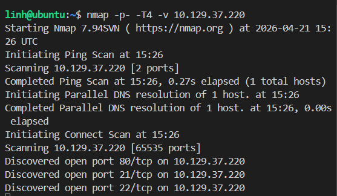
  - Found 3 TCP ports open.
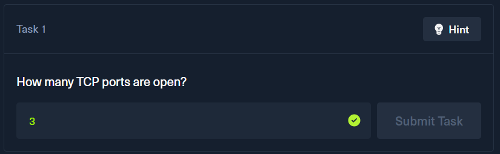
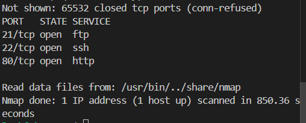

### Task 2

- **Question:** After running a "Security Snapshot", the browser is redirected to a path of the format /[something]/[id], where [id] represents the id number of the scan. What is the [something]?

- **Analysis:**
  - Access the website `http://10.129.38.96`, click on 'Security Snapshot' and check the URL.
  - [id] is `1`, and [something] is `data`.
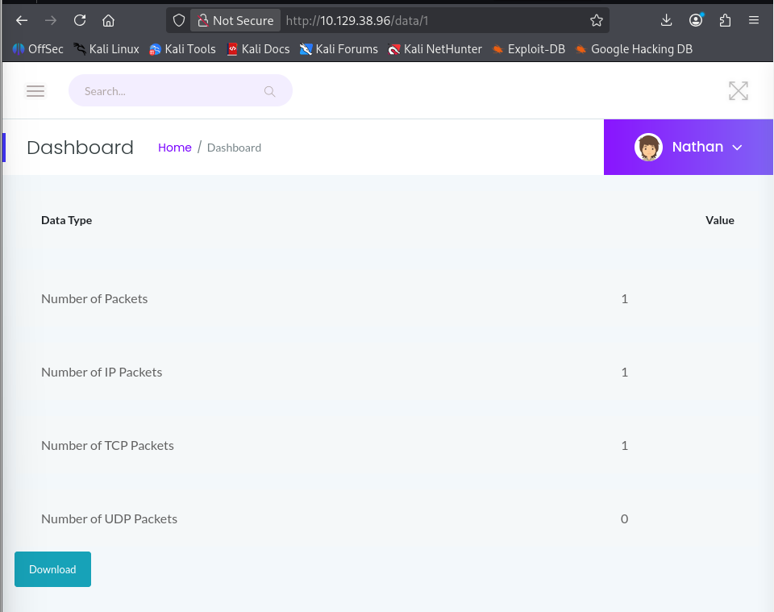
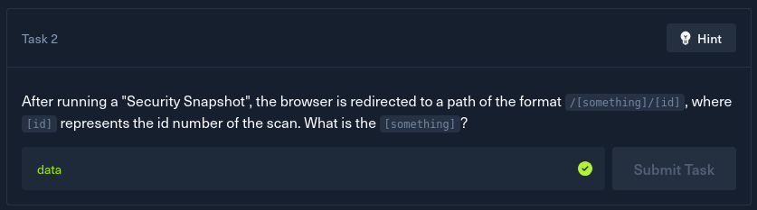

### Task 3

- **Question:** Are you able to get to other users' scans?

- **Analysis:**
  - Try to change [id] from 0 to 4 in the URL, the data on the `Security Snapshot` page updates.
  - This indicates an IDOR vulnerability, allowing unauthorized access to other users' scans.

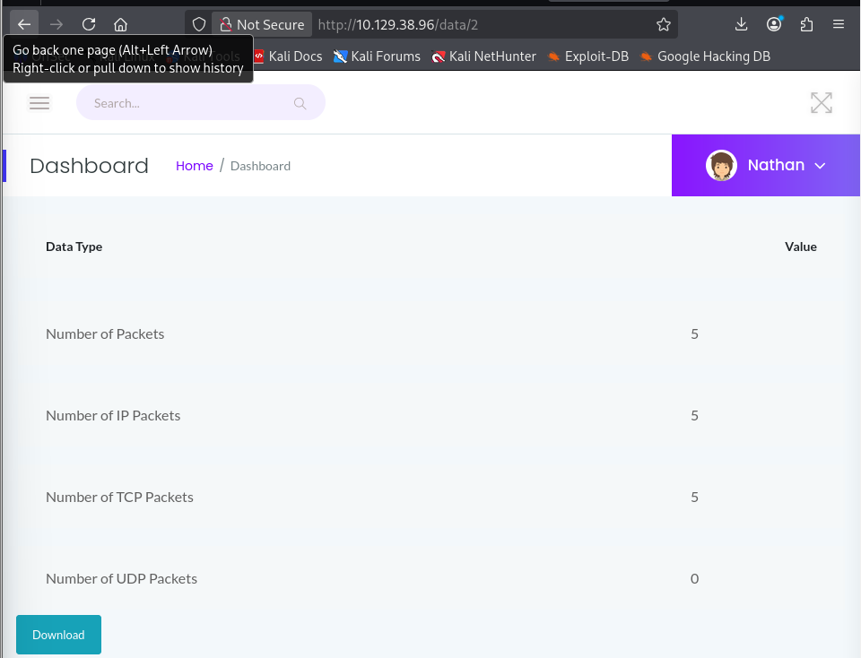

### Task 4

- **Question:** What is the ID of the PCAP file that contains sensative data?

- **Analysis:**
  - Download `0.pcap` because number of packets in this URL id `0` is higher than in the other ID URLS.
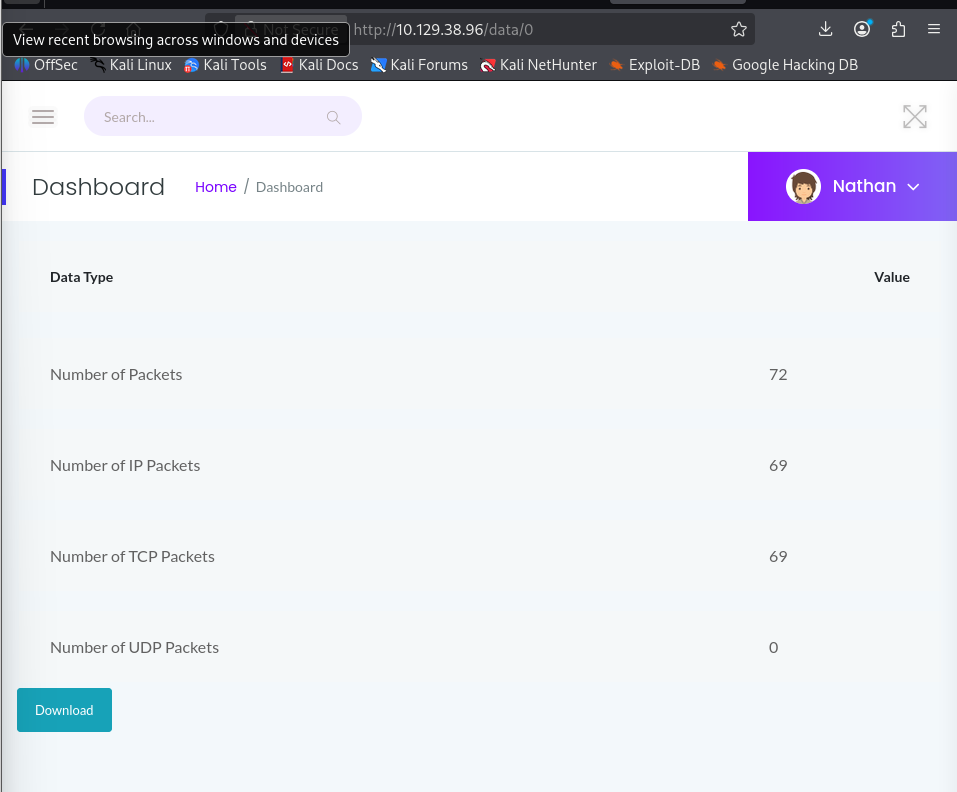
  - Right-click on a packet and select Follow -> TCP Stream. In `tcp.stream eq 3`, I discovered the plaintext credentials for user 'nathan'.

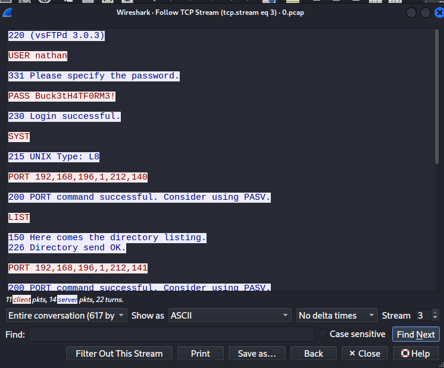

### Task 5

- **Question:** Which application layer protocol in the pcap file can the sensetive data be found in?

- **Analysis:**
  - Looking at the TCP stream, the service starts with a `220 vsFTPd 3.0.3` banner, shows the use of `FTP` (vsFTPd 3.0.3). This protocol transmits data in cleartext.

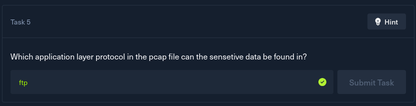

### Task 6

- **Question:** We've managed to collect nathan's FTP password. On what other service does this password work?

- **Analysis:**
  - Earlier port scanning revealed 3 open TCP ports: 21(FTP), 22(SSH) and 80(HTTP). I used password to log in via SSH.
  - The SSH login was successful.
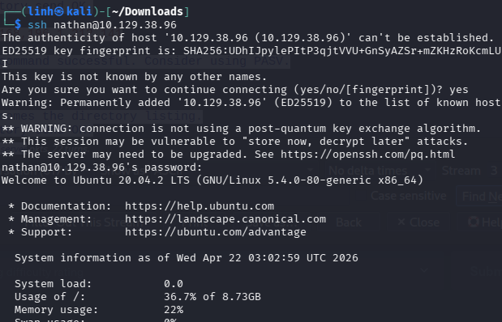

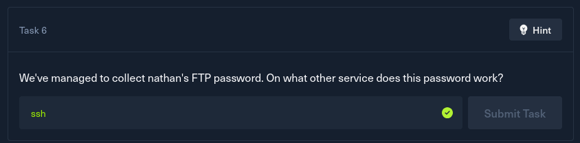

### Task 7

- **Question:** Submit the flag located in the nathan user's home directory.

- **Analysis:**
  - Run `ls` to list all files and folders at nathan's home directory, I found file user.txt.
  - Run `cat user.txt` to read content.
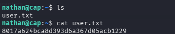

### Task 8

- **Question:** What is the full path to the binary on this machine has special capabilities that can be abused to obtain root privileges?

- **Analysis:**
  - Run `getcap -r / 2>/dev/null` to list binaries with special capabilities.
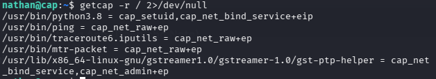
  - The `getcap` command reveals that `/usr/bin/python3.8` has the cap_setuid capability enabled. This allows a regular user to manipulate the process UID and escalate privileges to root.
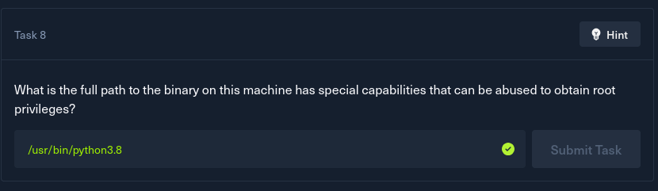

### Task 9

- **Question:** Submit the flag located in root's home directory.

- **Analysis:**
  - Run `python3.8 -c 'import os; os.setuid(0); os.system("/bin/bash")'` to set uid to 0(root) and spawn a new shell with root privileges.
  - Run `cd /root` to access the root folder, run `ls` to list files and folders in this root folder.
  - Run cat root.txt to read the flag.
  
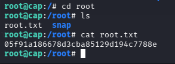

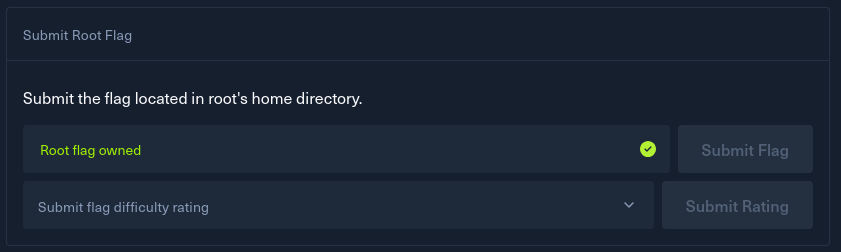