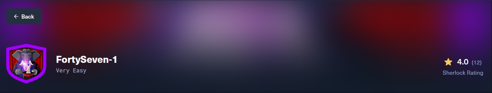
# Challenge Profile

- **Platform:** HackTheBox
- **Track:** Sherlocks (Defensive Security / Blue Team)
- **Category:** DFIR (Digital Forensics and Incident Response)
- **Difficulty Level:** Very Easy
- **Sherlock Scenario:**: 
    An APT group is using Hajj-themed phishing lures to target and steal WhatsApp data from government and diplomatic officials. Our team has gathered fragmented intelligence from public cybersecurity vendor reports, blog posts, and internal security alerts. Your task is to build a comprehensive profile of the threat actor responsible. You must connect the dots between different reports to answer questions about their identity, tools, and motives.

    Below are the sites we have compiled, use these to answer the following questions. (If any of the sites become unavailable please check on wayback machine as they all have been saved).

    Evidence - 1 - `https://securelist.com/mysterious-elephant-apt-ttps-and-tools/117596/ `
    Evidence - 2 - `https://medium.com/@knownsec404team/apt-k-47-mysterious-elephant-a-new-apt-organization-in-south-asia-5c66f954477`
    Evidence - 3 - `https://medium.com/@knownsec404team/unveiling-the-past-and-present-of-apt-k-47-weapon-asyncshell-5a98f75c2d68`

# Solving

### Task 1

- **Question**: What is the primary name of the APT group described in the SecureList report?

- **Analysis**:
  - Access the link  Evidence - 1 and collect the information

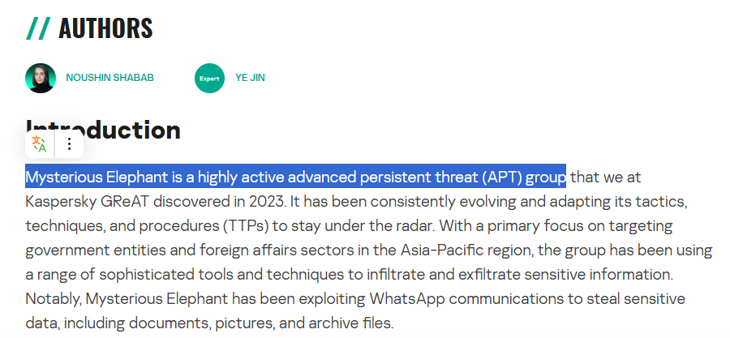

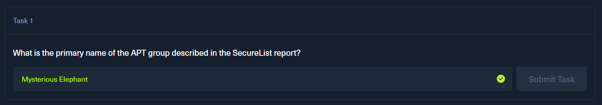

### Task 2

- **Question**: According to the Knownsec 404 team's analysis(Evidence -3), since which year has this group's attack activity been dated back to?

- **Analysis**:
  - Access the link Evidence - 3 and collect the information

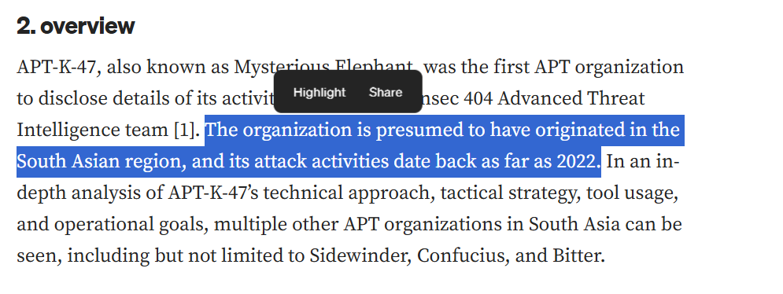

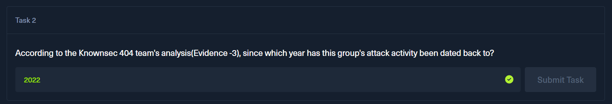

### Task 3

- **Question**: The group uses a custom backdoor that communicates via Office Remote Procedure Call (ORPCBackdoor). According to the Knownsec 404 team's analysis(Evidence -2), what is the name of the first malicious exported entry function?

- **Analysis**:
  - Access the link Evidence - 2 and collect the information

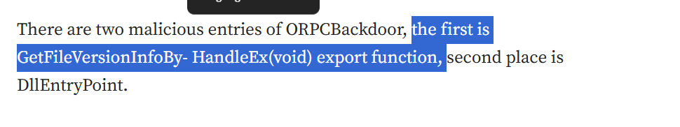

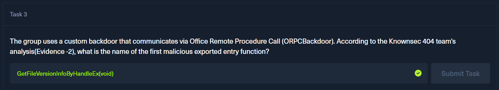

### Task 4

- **Question**: The previously mentioned backdoor checks for a file before creating persistence. What is the name of the file?

- **Analysis**:
  - Access the link: Evidence - 2 and collect the information

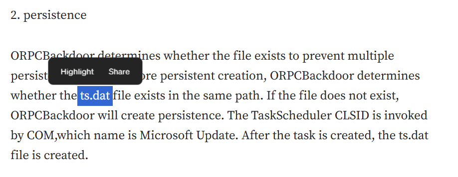

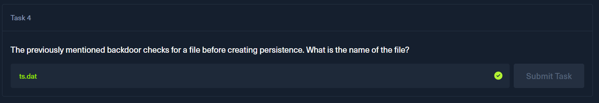

### Task 5

- **Question**: The use of the backdoor links the APT to another well-known South Asian APT group. What is the name of this other group?

- **Analysis**:
  - Access the link Evidence-3 and Evidence - 2 and collect the information

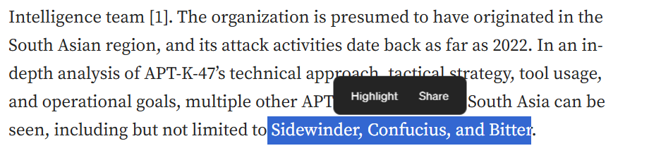
  
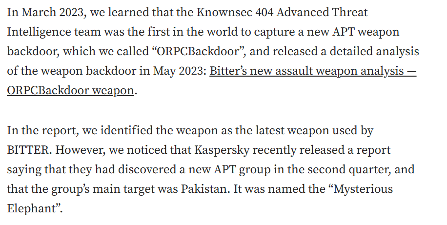

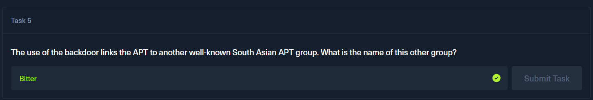

### Task 6

- **Question**:The APT group we are currently investigating has consistently used and updated another backdoor since 2023, with its C2 communication evolving from TCP to HTTPS. What is the name of this tool?

- **Analysis**:
  - Access the link Evidence-3 and collect the information

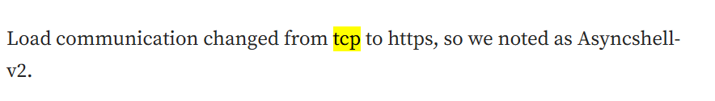

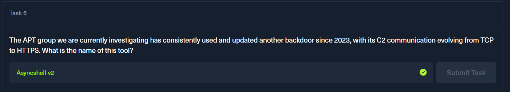

### Task 7

- **Question**:To evade sandbox analysis, the MemLoader HidenDesk tool checks the number of active processes before running. What is the minimum number of processes required for it to proceed?

- **Analysis**:
  - Access the link Evidence-1 and collect the information

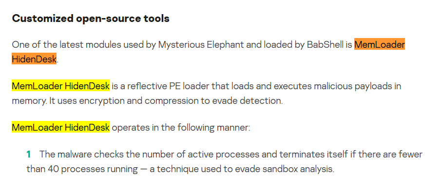

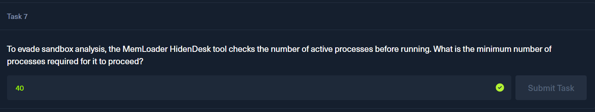

### Task 8

- **Question**:The MemLoader HidenDesk tool creates a covert environment for its activities by creating and switching to a specific environment. What is the name of this hidden desktop?

- **Analysis**:
  - Access the link Evidence-1 and collect the information

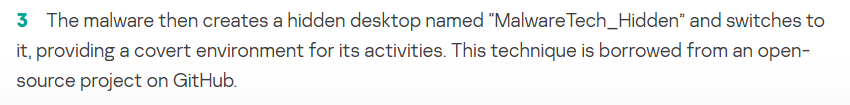

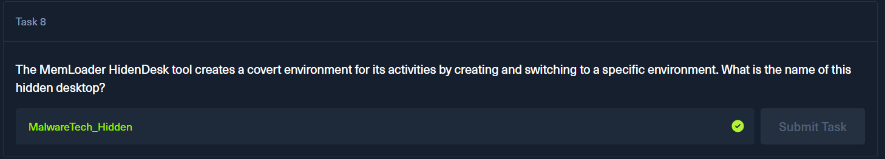

### Task 9

- **Question**:The MemLoader HidenDesk tool achieves persistence by placing a shortcut in the autostart folder to ensure it runs after a system reboot. What is the MITRE ATT&CK ID for the 'Registry Run Keys / Startup Folder' technique?

- **Analysis**:
  - Search google.com

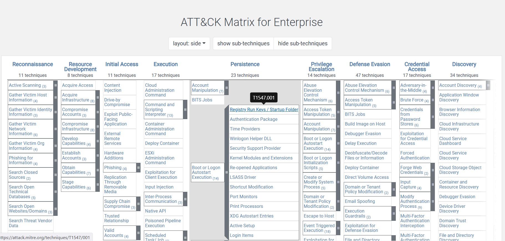

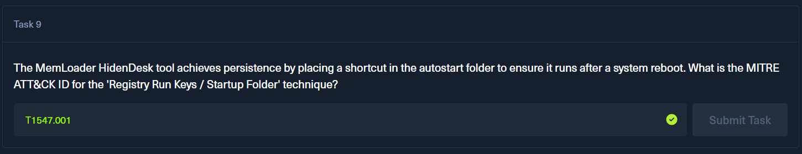

### Task 10

- **Question**:The actor uses several custom exfiltration tools targeting WhatsApp. What is the name of the tool that recursively searches specific directories, including the “Desktop” and “Downloads” folders?

- **Analysis**:
  - Access the link Evidence-1 and collect the information

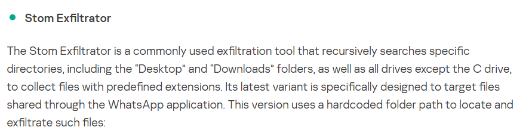

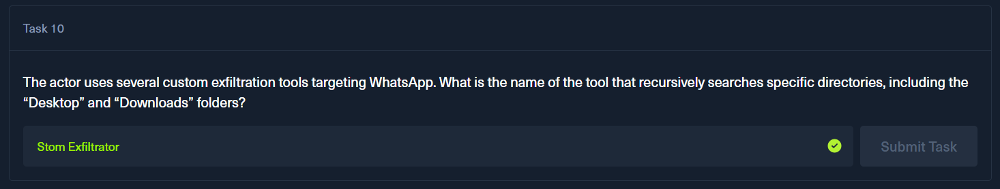

### Task 11

- **Question**: Kaspersky's analysis highlights the actor's heavy use of scripts for execution and deploying payloads. What is the MITRE ATT&CK ID for the 'PowerShell' technique?

- **Analysis**:
  - Search google.com

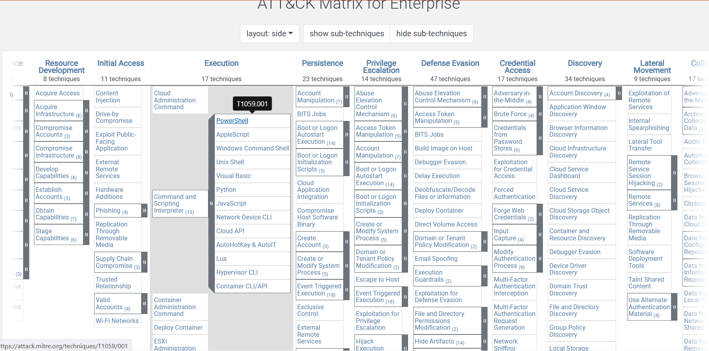

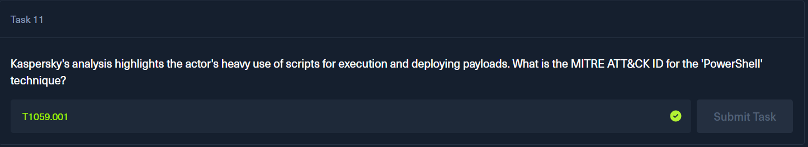

### Task 12

- **Question**:In their early attack chains, Mysterious Elephant used a downloader that was previously associated with the Origami Elephant group. What was the name of this downloader?

- **Analysis**:
  - Access the link Evidence-1 and collect the information

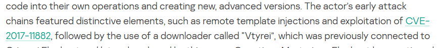

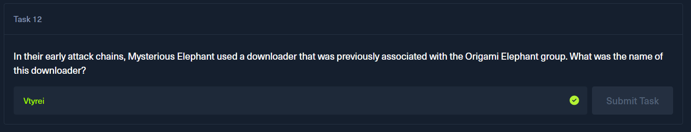

### Task 13

- **Question**:In a January 2024 campaign delivering an Asyncshell payload, which CVE was exploited in the malicious archive file?

- **Analysis**:
  - Access the link Evidence-3 and collect the information

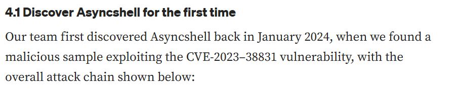

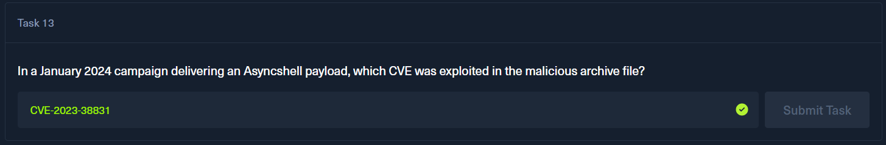

### Task 14

- **Question**:What is the MD5 hash of the ChromeStealer Exfiltrator sample named WhatsAppOB.exe?

- **Analysis**:
  - Access the link Evidence-1 and collect the information

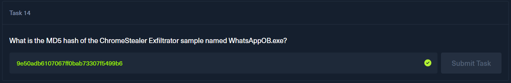

### Task 15

- **Question**:The intelligence describes multiple custom tools designed to upload stolen data to the actor's servers. According to the MITRE ATT&CK framework, what is the ID for the 'Exfiltration Over C2 Channel' technique?

- **Analysis**:
  - Search google.com :))

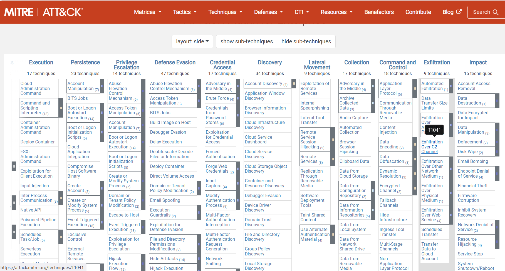

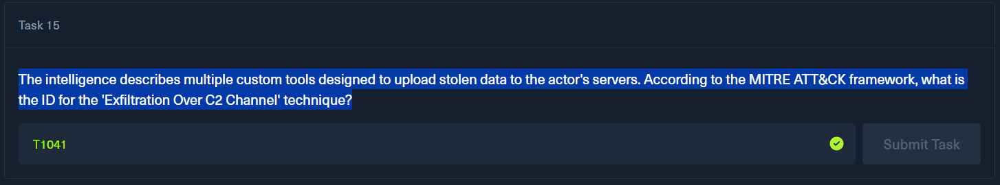