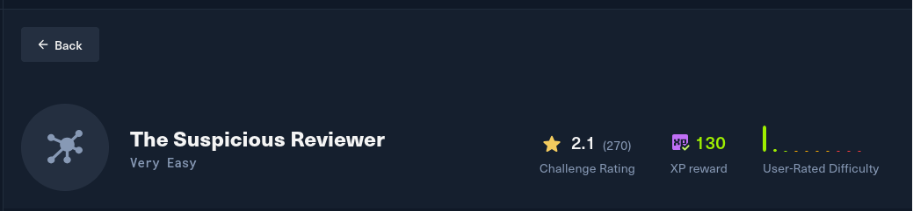
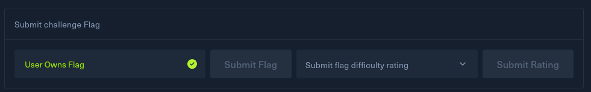

# Challenge Profile

- **Platform:** HackTheBox
- **Category:** OSINT
- **Difficulty Level:** Very Easy
- **Challenge Scenario:**: Trainee,

We've identified a potentially fraudulent social media profile that may be part of a larger astroturfing campaign. The profile "TechReviewer2024" on SocialConnect shows several red flags indicating artificial creation and coordinated inauthentic behavior.

Your mission is to investigate this profile thoroughly and extract any contact information that could lead to the real person behind this fake account.

Submit your findings in the (case insensitive) format: HTB{contactemail}. Example: HTB{Gonzalo.Ramirez@email.com}.

– Training Division Digital Forensics Unit

# Solving

- Spawn machine and access the website `TechReview`

- Click on About, then Contact button -> see email address

- Get the flag

