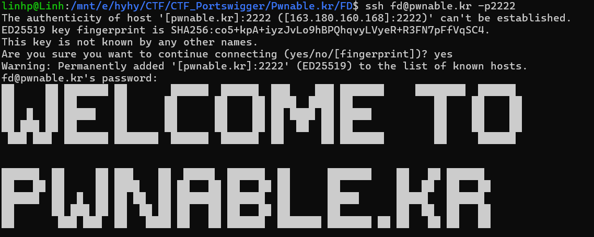
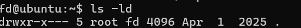
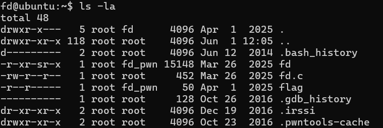
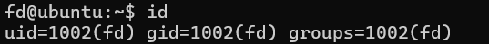
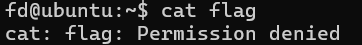
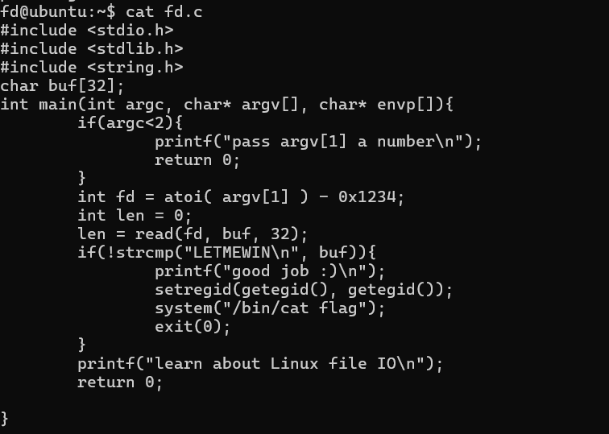
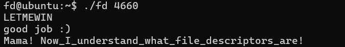

# File Descriptor

**Challenge:** Mommy! what is a file descriptor in Linux?

*Try to play the wargame yourself, but if you are an ABSOLUTE beginner, follow this tutorial:*
[YouTube Tutorial](https://youtu.be/971eZhMHQQw)

**SSH Access:**
```
ssh fd@pwnable.kr -p2222
Password: guest
```

## What is a File Descriptor?

A file descriptor (FD) is an integer value used by operating systems to reference open files or I/O resources, such as files, sockets, or pipes. In Unix-like systems, every process has a table of file descriptors, which are used for low-level input/output operations.

### Common File Descriptors
- **0**: Standard Input (stdin)
- **1**: Standard Output (stdout)
- **2**: Standard Error (stderr)

File descriptors are essential in system programming, exploit development, and CTF challenges, as they allow direct interaction with files and processes. Manipulating FDs can help redirect input/output, duplicate streams, or access restricted resources.

---
Connecting to the server fd@pwnable.kr with port 2222, password: guest



`ls -ld`: display detailed information about a directory itself



`ls -la`: display all files (including hidden ones) in a directory in long listing format



`id`: show user ID, group ID(gid), group memberships

 

After running `ls -la`, the file `flag` is visible, but attempting `cat flag` returns "Permission denied".  



That flag is owned by root, root and group fd_pwn can read, others can't and we're not owner and not in group.
We see file fd also owned by root and group fd_pwn. But others can read and excute. This file is compiled from fd.c: `cat fd.c` 



This code reads up to 32 bytes from a file descriptor (FD) supplied by the user. If the data read is exactly LETMEWIN\n, the program elevates its group rights using setregid and executes cat flag.

Takes argv[1] (a number) and computes: `fd = atoi(argv[1]) - 0x1234` with 0x1234: 4660
It calls read(fd, buf, 32) to read up to 32 bytes into buf.
- If buf == "LETMEWIN\n": 
  - prints good job :)
  - calls setregid(getegid(), getegid())
  - runs system("/bin/cat flag")

Run `./fd 4660` -> fd = 4660 - 4660 = 0 => call stdin => Enter Input: LETMEWIN => cat flag.

Got the flag: Mama! Now_I_understand_what_file_descriptors_are!

